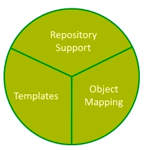

# Spring Data JPA

是JPA 规范的再次封装抽象，底层还是使用了 Hibernate 的 JPA 技术实现，引用 JPQL（Java Persistence Query Language）查询语言，属于 Spring 的整个生态体系的一部分。由于 Spring Boot 和 Spring Cloud 在市场上的流行，Spring Data JPA 也逐渐进入大家的视野，他们有机的整体，使用起来比较方便，加快了开发的效率，使开发者不需要关系和配置更多的东西，完全可以沉浸在 Spring 的完整生态标准的实现下，上手简单、开发效率高，又对对象的支持比较好，又有很大的灵活性，市场的认可度越来越高。

## JPA 的介绍以及哪些开源实现

JPA（Java Persistence API）中文名 Java 持久层 API，是 JDK 5.0 注解或 XML 描述对象－关系表的映射关系，并将运行期的实体对象持久化到数据库中。

**JPA 包括以下三方面的内容：**

- 一套 API 标准，在 javax.persistence 的包下面，用来操作实体对象，执行 CRUD 操作，框架在后台替代我们完成所有的事情，开发者从繁琐的 JDBC 和 SQL 代码中解脱出来。
- 面向对象的查询语言：Java Persistence Query Language（JPQL），这是持久化操作中很重要的一个方面，通过面向对象而非面向数据库的查询语言查询数据，避免程序的 SQL 语句紧密耦合。
- ORM（Object/Relational Metadata）元数据的映射，JPA 支持 XML 和 JDK 5.0 注解两种元数据的形式，元数据描述对象和表之间的映射关系，框架据此将实体对象持久化到数据库表中。

**JPA 的开源实现**

JPA 的宗旨是为 POJO 提供持久化标准规范，经过这几年的实践探索，能够脱离容器独立运行，方便开发和测试的理念已经深入人心了。Hibernate 3.2+、TopLink 10.1.3 以及 OpenJPA、QueryDSL 都提供了 JPA 的实现，以及最后的 Spring 的整合 Spring Data JPA。目前互联网公司和传统公司大量使用了 JPA 的开发标准规范。


## Spring Data

Spring Data 项目是从 2010 年开发发展起来的，从创立之初 Spring Data 就想提供一个大家熟悉的、一致的、基于 Spring 的数据访问编程模型，同时仍然保留底层数据存储的特殊特性。它可以轻松地让开发者使用数据访问技术包括：关系数据库、非关系数据库（NoSQL）和基于云的数据服务。

Spring Data Common 是 Spring Data 所有模块的公用部分，该项目提供跨 Spring 数据项目的共享基础设施，它包含了技术中立的库接口以及一个坚持 Java 类的元数据模型。

Spring Data 不仅对传统的数据库访问技术：JDBC、Hibernate、JDO、TopLick、JPA、MyBatis 做了很好的支持和扩展、抽象、提供方便的 API，还对 NoSQL 等非关系数据做了很好的支持：MongoDB 、Redis、Apache Solr 等。

**Spring Data 的子项目：**

主要项目（Main Modules）：

- Spring Data Commons
- Spring Data Gemfire
- Spring Data JPA
- Spring Data KeyValue
- Spring Data LDAP
- Spring Data MongoDB
- Spring Data REST
- Spring Data Redis
- Spring Data for Apache Cassandra
- Spring Data for Apache Solr

社区支持的项目（Community Modules）：

- Spring Data Aerospike
- Spring Data Couchbase
- Spring Data DynamoDB
- Spring Data Elasticsearch
- Spring Data Hazelcast
- Spring Data Jest
- Spring Data Neo4j
- Spring Data Vault

其他（Related Modules）：

- Spring Data JDBC Extensions
- Spring for Apache Hadoop
- Spring Content

还有许多开源社区做出的许多贡献如 MyBatis 等。

市面上主要的如图所示：


### Spring Data 操作的主要特性

Spring Data 项目旨在为大家提供一种通用的编码模式，数据访问对象实现了对物理数据层的抽象，为编写查询方法提供了方便。通过对象映射，实现域对象和持续化存储之间的转换，而模板提供的是对底层存储实体的访问实现，操作上主要有如下特征：

- 提供模板操作，如 Spring Data Redis 和 Spring Data Riak；
- 强大的 Repository 和定制的数据储存对象的抽象映射；
- 对数据访问对象的支持（Auting 等）。



### Spring Data JPA 的主要类及结构图

需要掌握和使用到的类：

七个大 Repository 接口：

- Repository（org.springframework.data.repository）；
- CrudRepository（org.springframework.data.repository）；
- PagingAndSortingRepository（org.springframework.data.repository）；
- JpaRepository（org.springframework.data.jpa.repository）；
- QueryByExampleExecutor（org.springframework.data.repository.query）；
- JpaSpecificationExecutor（org.springframework.data.jpa.repository）；
- QueryDslPredicateExecutor（org.springframework.data.querydsl）。

两大 Repository 实现类：

- SimpleJpaRepository（org.springframework.data.jpa.repository.support）；
- QueryDslJpaRepository（org.springframework.data.jpa.repository.support）。

类的结构关系图如图所示：


## JPA 基础查询方法 JpaRepository 详解

### Spring Data Common 的 Repository

Repository 位于 Spring Data Common 的 lib 里面，是 Spring Data 里面做数据库操作的最底层的抽象接口，最顶级的父类，源码里面其实什么方法都没有，仅仅起到一个标识作用。管理域类以及域类的 ID 类型作为类型参数，此接口主要作为标记接口来捕获要使用的类型，并帮助用户发现扩展此接口的接口。Spring 底层做动态代理的时候发现只要是它的子类或者实现类，都代表储存库操作。

Repository 的源码如下：

``` java
package org.springframework.data.repository;
import org.springframework.stereotype.Indexed;
@Indexed
public interface Repository<T, ID> {

}
```

这个接口定义了所有 Repostory 操作的实体和 ID 的泛型参数。当不是继承任何就可，只要继承这个接口，就可以使用 Spring JPA 里面提供的很多约定的方法查询和注解查询。

### Repository 的类层次关系（Diagms/Hierarchy/Structure）


通过上面的类的结构图，可以看得出来 Repository 可以分为三个部分：

- 正常的 JpaRepository 这条线的操作。
- ReactiveRepository 这条线响应式编程，主要支持目前的 NoSQL 方面的操作，因为 NoSQL 大部分的操作都是分布式的，所以足可以看的出来 Spring Data 的野心，想提供关于所有 Data 方面的操，目前主要有 Cassandra、MongoDB 的实现，与 JPA 属于平级项目。
- RxJava2CrudRepository 这条线是为了支持 RxJava 2 做的标准的响应式编程的接口。

**Repository 的实例：**

``` java
package com.example.example2.repository;
import com.example.example2.entity.User;
import org.springframework.data.repository.Repository;
import java.util.List;
public interface UserRepository extends Repository<User,Integer> {
    /**
     * 根据名称进行查询用户列表
     * @param name
     * @return
     */
    List<User> findByName(String name);
    /**
     * 根据用户的邮箱和名称查询
     *
     * @param email
     * @param name
     * @return
     */
    List<User> findByEmailAndName(String email, String name);
}
```

### CrudRepository 方法详解


通过上面类关系图可以看到 CrudRepository 提供了公共的通用的 CRUD 方法。

**CrudRepository interface 内容**

``` java
package org.springframework.data.repository;
import java.util.Optional;
@NoRepositoryBean
public interface CrudRepository<T, ID> extends Repository<T, ID> {
    <S extends T> S save(S entity);(1)
    <S extends T> Iterable<S> saveAll(Iterable<S> entities);(2)
    Optional<T> findById(ID id);(3)
    boolean existsById(ID id);(4)
    Iterable<T> findAll();(5)
    Iterable<T> findAllById(Iterable<ID> ids);(6)
    long count();(7)
    void deleteById(ID id);(8)
    void delete(T entity);(9)
    void deleteAll(Iterable<? extends T> entities);(10)
    void deleteAll();(11)
}
```

* 保存实体方法。

原理：通过刚才的类关系查看其实现类，SimpleJpaRepository 里面的实现方法如下：

``` java
    @Transactional
    public <S extends T> S save(S entity) {
        if (entityInformation.isNew(entity)) {
            em.persist(entity);
            return entity;
        } else {
            return em.merge(entity);
        }
    }
```

可以发现它是先查一下传进去的实体是不是存在，然后判断是新增还是更新，是不是存在根据两种机制，一种是根据主键来判断，还有一种是根据 Version 来判断。所以如果去看 JPA 的控制台打印出来的 SQL 最少会有两条，一条是查询，一条是 `Insert` 或者 `Update`。

- 批量保存，原理和上面的那一条相同，我们去看实现的话，就是 for 循环调用上面的 save 方法。  
- 根据主键查询实体，返回 JDK 1.8 的 Optional，这可以避免 null exception。
- 根据主键判断实体是否存在。
- 查询实体的所有列表。
- 根据主键列表查询实体列表。
- 查询总数。
- 根据主键删除，查看源码会发现，其是先查询出来再进行删除。
- 根据 entity 进行删除。
- 批量删除。
- 删除所有，原理：通过刚才的类关系查看其的实现类，SimpleJpaRepository 里面的 delete 实现方法如下，都是调用 delete 进行删除。

``` java
    @Transactional
    public void deleteById(ID id) {
        Assert.notNull(id, ID_MUST_NOT_BE_NULL);
        delete(findById(id).orElseThrow(() -> new EmptyResultDataAccessException(
                String.format("No %s entity with id %s exists!", entityInformation.getJavaType(), id), 1)));
    }
    @Transactional
    public void delete(T entity) {
        Assert.notNull(entity, "The entity must not be null!");
        em.remove(em.contains(entity) ? entity : em.merge(entity));
    }
    @Transactional
    public void deleteAll(Iterable<? extends T> entities) {
        Assert.notNull(entities, "The given Iterable of entities not be null!");
        for (T entity : entities) {
            delete(entity);
        }
    }
```

> 关于 `Update`、`Delete`、`Save` 等操作 JPA 自己也会先查询一下，再去做保存操作，不存在抛出异常。

**CrudRepository Interface 的使用案例**

使用也很简单，只需要自己的 Repository 继承 CrudRepository 即可。

``` java
package com.example.example2.repository;
import com.example.example2.entity.User;
import org.springframework.data.repository.CrudRepository;
import java.util.List;
public interface UserCrudRepository extends CrudRepository<User,Integer> {
}
```

例如：

``` java
package com.example.example2;
import com.example.example2.entity.User;
import com.example.example2.repository.UserRepository;
import org.springframework.beans.factory.annotation.Autowired;
import org.springframework.stereotype.Controller;
import org.springframework.web.bind.annotation.GetMapping;
import org.springframework.web.bind.annotation.RequestMapping;
import org.springframework.web.bind.annotation.RequestParam;
import org.springframework.web.bind.annotation.ResponseBody;
import java.util.Optional;
@Controller
@RequestMapping(path = "/demo")
public class UserController {
    @Autowired
    private UserCrudRepository userRepository;

    @GetMapping(path = "/add")
    public void addNewUser(@RequestParam String name, @RequestParam String email) {
        User n = new User();
        n.setName(name);
        n.setEmail(email);
        userRepository.save(n);
    }

    @GetMapping(path = "/all")
    @ResponseBody

    public Iterable<User> getAllUsers() {
        return userRepository.findAll();
    }

    @GetMapping(path = "/info")
    @ResponseBody

    public Optional<User> findOne(@RequestParam Integer id) {
        return userRepository.findById(id);
    }

    @GetMapping(path = "/delete")

    public void delete(@RequestParam Integer id) {
        userRepository.deleteById(id);
    }
}
```

### PagingAndSortingRepository 方法详解

PagingAndSortingRepository 继承 CrudRepository 所有的基本方法，它都增加了分页和排序等对查询结果进行限制的一些基本的、常用的、通用的一些分页方法。

**PagingAndSortingRepository interface 内容**

 PagingAndSortingRepository 的源码：

``` java
package org.springframework.data.repository;
import org.springframework.data.domain.Page;
import org.springframework.data.domain.Pageable;
import org.springframework.data.domain.Sort;
@NoRepositoryBean
public interface PagingAndSortingRepository<T, ID> extends CrudRepository<T, ID> {
    Iterable<T> findAll(Sort sort); （1）
    Page<T> findAll(Pageable pageable); （2）
}
```

- 根据排序取所有的对象的集合。
- 根据分页和排序进行查询，并用 Page 对象封装。Pageable 对象包含分页和 Sort 对象。

PagingAndSortingRepository 和 CrudRepository 都是 Spring Data Common 的标准接口，如果我们采用 JPA 那它对应的实现类就是 Spring Data JPA 的 Model 里面的 SimpleJpaRepository。如果是其他 NoSQL 实现 MongoDB，那它的实现就在 Spring Data MongoDB 的 Model 里面。

 Page 查询的实现内容如下：

``` java
    public Page<T> findAll(Pageable pageable) {
        if (isUnpaged(pageable)) {
            return new PageImpl<T>(findAll());
        }
        return findAll((Specification<T>) null, pageable);
    }
```

**PagingAndSortingRepository 使用案例**

只需要继承 PagingAndSortingRepository 的接口即可，其他不要做任何改动。例如：

``` java
package com.example.example2.repository;
import com.example.example2.entity.User;
import org.springframework.data.domain.Page;
import org.springframework.data.domain.Pageable;
import org.springframework.data.repository.PagingAndSortingRepository;
public interface UserPagingAndSortingRepository extends PagingAndSortingRepository<User,Long> {
    Page<User> findByName(String name, Pageable pageable) throws Exception;
}
```

``` java
@Controller
@RequestMapping(path = "/demo")
public class UserController {
    /**
     * 验证排序和分页查询方法，Pageable的默认实现类：PageRequest
     * @return
     */
    @GetMapping(path = "/page")
    @ResponseBody
    public Page<User> getAllUserByPage() {
        return userPagingAndSortingRepository.findAll(
                new PageRequest(1, 20,new Sort(new Sort.Order(Sort.Direction.ASC,"name"))));
    }
    /**
     * 排序查询方法，使用Sort对象
     * @return
     */
    @GetMapping(path = "/sort")
    @ResponseBody
    public Iterable<User> getAllUsersWithSort() {
        return userPagingAndSortingRepository.findAll(new Sort(new Sort.Order(Sort.Direction.ASC,"name")));
    }
}
```

### JpaRepository 方法详解

JpaRepository 开始是对关系型数据库进行抽象封装，从类图可以看得出来它继承 PagingAndSortingRepository 类，也就继承了其所有方法，并且其实现类也是 SimpleJpaRepository。从类图上还可以看出 JpaRepository 继承和拥有了 QueryByExampleExecutor 的相关方法。

``` java
package org.springframework.data.jpa.repository;

import java.util.List;

import javax.persistence.EntityManager;

import org.springframework.data.domain.Example;
import org.springframework.data.domain.Sort;
import org.springframework.data.repository.NoRepositoryBean;
import org.springframework.data.repository.PagingAndSortingRepository;
import org.springframework.data.repository.query.QueryByExampleExecutor;

/**
 * JPA specific extension of {@link org.springframework.data.repository.Repository}.
 *
 * @author Oliver Gierke
 * @author Christoph Strobl
 * @author Mark Paluch
 */
@NoRepositoryBean
public interface JpaRepository<T, ID> extends PagingAndSortingRepository<T, ID>, QueryByExampleExecutor<T> {

    /*
     * (non-Javadoc)
     * @see org.springframework.data.repository.CrudRepository#findAll()
     */
    List<T> findAll();

    /*
     * (non-Javadoc)
     * @see org.springframework.data.repository.PagingAndSortingRepository#findAll(org.springframework.data.domain.Sort)
     */
    List<T> findAll(Sort sort);
    List<T> findAllById(Iterable<ID> ids);
    <S extends T> List<S> saveAll(Iterable<S> entities);
    void flush();
    <S extends T> S saveAndFlush(S entity);
    void deleteInBatch(Iterable<T> entities);
    void deleteAllInBatch();
    T getOne(ID id);
    <S extends T> List<S> findAll(Example<S> example);
    <S extends T> List<S> findAll(Example<S> example, Sort sort);
}
```

通过源码和 CrudRepository 相比较其支持了 Query By Example、批量删除、提高删除效率、手动刷新数据库的更改方法，将默认实现的查询结果变成了 List。

JpaRepository 使用方法也一样，只需要继承它即可，例如：

``` java
package com.example.example2.repository;
import com.example.example2.entity.User;
import org.springframework.data.jpa.repository.JpaRepository;
public interface UserJpaRepository extends JpaRepository<User,Long> {
}
```

### Repository 的实现类 SimpleJpaRepository

SimpleJpaRepository 是 JPA 整个关联数据库的所有 Repository 的接口实现类，如果想进行扩展，可以继承此类，如 QueryDsl 的扩展，还有默认的处理机制。如果将此类里面的实现方法看透了，基本上 JPA 的 API 就能掌握大部分，同时也是 Spring JPA 的动态代理的实现类，包括Query Method。

SimpleJpaRepository 的部分源码如下：

``` java
@Repository
@Transactional(readOnly = true)
public class SimpleJpaRepository<T, ID> implements JpaRepository<T, ID>, JpaSpecificationExecutor<T> {
    private static final String ID_MUST_NOT_BE_NULL = "The given id must not be null!";
    private final JpaEntityInformation<T, ?> entityInformation;
    private final EntityManager em;
    private final PersistenceProvider provider;
    private @Nullable CrudMethodMetadata metadata;
    ......
    @Transactional
    public void deleteAllInBatch() {
        em.createQuery(getDeleteAllQueryString()).executeUpdate();
    }
    ......
```

可以看出 SimpleJpaRepository 的实现机制，通过 EntityManger 进行实体的操作，JpaEntityInforMation 里面存着实体的相关信息，还有 crud 方法的元数据等。

## 定义查询方法（Defining Query Methods）

Spring Data JPA 的最大特色，利用方法名定义查询方法。

### 定义查询方法的配置方法

由于 Spring JPA Repository 的实现原理是采用动态代理的机制，所以介绍两种定义查询方法，从方法名称中可以指定特定用于存储的查询和更新，或通过使用 `@Query` 手动定义的查询，取决于实际对数据的操作，只需要实体 Repository 继承 Spring Data Common 里面的 Repository 接口即可。如果想有其他更多默认通用方法的实现，可以选择 JpaRepository、PagingAndSortingRepository、CrudRepository 等接口，也可以直接继承 JpaSpecificationExecutor、QueryByExampleExecutor，QuerydslPredicateExecutor 和自定义 Response，都可以达到同样的效果。

如果不想扩展 Spring 数据接口，还可以使用它来注解存储库接口 `@RepositoryDefinition`，扩展 CrudRepository 公开了一套完整的方法来操纵实体。如果希望对所暴露的方法有选择性，只需将要暴露的方法复制 CrudRepository 到域库中即可，其实也是自定义 Repository 的一种。

例如：选择性地暴露CRUD方法:

``` java
@NoRepositoryBeaninterface
MyBaseRepository<T, ID extends Serializable> extends Repository<T, ID> {
    T findOne(ID id);
    T save(T entity);
}
interface UserRepository extends MyBaseRepository<User, Long> {
     User findByEmailAddress(EmailAddress emailAddress);
}
```

在此实例中，为所有域存储库定义了一个公共基础接口，并将其暴露出来，`findOne(…)` 和 `save(…)` 这些方法将由 Spring Data 路由到开发者提供的 MyBaseRepository 的基本 Repository 实现中。在 JPA 的默认情况下，SimpleJpaRepository 作为上面两个接口的实现类，所以 UserRepository 现在将能够保存用户，并通过 ID 查找单个，以及触发查询以 Users 通过其电子邮件地址查找。

即：

- MyRepository Extends Repository 接口就可以实现 Defining Query Methods 的功能。
- 继承其他 Repository 的子接口，或者自定义子接口，可以选择性的暴漏 SimpleJpaRepository 里面已经实现的基础公用方法。

### 方法的查询策略设置

通过下面的命令来配置方法的查询策略：

``` java
@EnableJpaRepositories(queryLookupStrategy= QueryLookupStrategy.Key.CREATE_IF_NOT_FOUND)
```

其中，QueryLookupStrategy.Key 的值一共有三个：

- `Create`：直接根据方法名进行创建，规则是根据方法名称的构造进行尝试，一般的方法是从方法名中删除给定的一组已知前缀，并解析该方法的其余部分。如果方法名不符合规则，启动的时候会报异常。
- `USE_DECLARED_QUERY`：声明方式创建，即注解的方式。启动的时候会尝试找到一个声明的查询，如果没有找到将抛出一个异常，查询可以由某处注释或其他方法声明。
- `CREATE_IF_NOT_FOUND`：这个是默认的，以上两种方式的结合版。先用声明方式进行查找，如果没有找到与方法相匹配的查询，那用 Create 的方法名创建规则创建一个查询。

**除非有特殊需求，一般直接使用默认配置。**以 Spring Boot 项目为例，更改其配置方法如下：

``` java
@EnableJpaRepositories(queryLookupStrategy= QueryLookupStrategy.Key.CREATE_IF_NOT_FOUND)
public class Example1Application {
   public static void main(String[] args) {
      SpringApplication.run(Example1Application.class, args);
   }
}
```

QueryLookupStrategy 是策略的定义接口，JpaQueryLookupStrategy 是具体策略的实现类，类图如下：


### 查询方法的创建

内部基础架构中有个根据方法名的查询生成器机制，对于在存储库的实体上构建约束查询很有用，该机制方法的前缀 find…By、read…By、query…By、count…By 和 get…By 从所述方法和开始分析它的其余部分（实体里面的字段）。

引入子句可以包含其他表达式，例如在 Distinct 要创建的查询上设置不同的标志，然而，第一个 By 作为分隔符来指示实际标准的开始，在一个非常基本的水平，可以定义实体性条件，并与它们串联 And 和 Or。

> 一句话概况，带查询功能的方法名有查询策略（关键字）+ 查询字段 + 一些限制性条件组成。

例如：

``` java
interface PersonRepository extends Repository<User, Long> {
   // and的查询关系
   List<User> findByEmailAddressAndLastname(EmailAddress emailAddress, String lastname);
   // 包含distinct去重，or的sql语法
   List<User> findDistinctPeopleByLastnameOrFirstname(String lastname, String firstname);
   List<User> findPeopleDistinctByLastnameOrFirstname(String lastname, String firstname);
   // 根据lastname字段查询忽略大小写
   List<User> findByLastnameIgnoreCase(String lastname);
   // 根据lastname和firstname查询equal并且忽略大小写
   List<User> findByLastnameAndFirstnameAllIgnoreCase(String lastname, String firstname);
  // 对查询结果根据lastname排序
   List<User> findByLastnameOrderByFirstnameAsc(String lastname);
   List<User> findByLastnameOrderByFirstnameDesc(String lastname);
}
```

解析方法的实际结果取决于创建查询的持久性存储。但是，有以下情况要注意：

- 表达式通常是可以连接运算符的属性遍历，可以使用组合属性表达式 And 和 or，还可以得到这样的运算关键字为支撑 Between、LessThan、GreaterThan、Like 为属性表达式，受支持的操作员可能因数据存储而异，需要注意一下。
- 该方法解析器支持设置一个 IgnoreCase 标志个别特性（例如，findByLastnameIgnoreCase(…)）或对于支持忽略大小写（通常是一个类型的所有属性 String 情况下，如 findByLastnameAndFirstnameAllIgnoreCase(…)），是否支持忽略案例可能会因存储而异，需要了解特定于场景的查询方法。
- 还可以通过 OrderBy 在引用属性和提供排序方向（Asc 或 Desc）的查询方法中附加一个子句来应用静态排序，要创建支持动态排序的查询方法，来影响查询结果。

### 关键字列表

|      关键字       |                           案例                            |                   JPQL 表达                   |
| :---------------: | :-------------------------------------------------------: | :-------------------------------------------: |
|        And        |                findByLastnameAndFirstname                 | … where x.lastname = ?1  and x.firstname = ?2 |
|        Or         |                 findByLastnameOrFirstname                 |  … where x.lastname = ?1 or x.firstname = ?2  |
|     Is,Equals     | findByFirstname、findByFirstnameIs、findByFirstnameEquals |           … where x.firstname = ?1            |
|      Between      |                  findByStartDateBetween                   |     … where x.startDate between ?1 and ?2     |
|     LessThan      |                     findByAgeLessThan                     |              … where x.age < ?1               |
|   LessThanEqual   |                  findByAgeLessThanEqual                   |              … where x.age <= ?1              |
|    GreaterThan    |                   findByAgeGreaterThan                    |              … where x.age > ?1               |
| GreaterThanEqual  |                 findByAgeGreaterThanEqual                 |              … where x.age >= ?1              |
|       After       |                   findByStartDateAfter                    |           … where x.startDate > ?1            |
|      Before       |                   findByStartDateBefore                   |           … where x.startDate < ?1            |
|      IsNull       |                      findByAgeIsNull                      |             … where x.age is null             |
| IsNotNull,NotNull |                   findByAge(Is)NotNull                    |            … where x.age not null             |
|       Like        |                    findByFirstnameLike                    |          … where x.firstname like ?1          |
|      NotLike      |                  findByFirstnameNotLike                   |        … where x.firstname not like ?1        |
|   StartingWith    |                findByFirstnameStartingWith                | … where x.firstname like ?1 (参数增加前缀 %)  |
|    EndingWith     |                 findByFirstnameEndingWith                 | … where x.firstname like ?1 (参数增加后缀 %)  |
|    Containing     |                 findByFirstnameContaining                 |  … where x.firstname like ?1 (参数被 % 包裹)  |
|      OrderBy      |               findByAgeOrderByLastnameDesc                |  … where x.age = ?1 order by x.lastname desc  |
|        Not        |                     findByLastnameNot                     |           … where x.lastname <> ?1            |
|        In         |               findByAgeIn(Collection ages)                |              … where x.age in ?1              |
|       NotIn       |              findByAgeNotIn(Collection ages)              |            … where x.age not in ?1            |
|       True        |                    findByActiveTrue()                     |            … where x.active = true            |
|       False       |                    findByActiveFalse()                    |           … where x.active = false            |
|    IgnoreCase     |                 findByFirstnameIgnoreCase                 |     … where UPPER(x.firstame) = UPPER(?1)     |

除了 find 的前缀之外，查看 PartTree 的源码，还有如下几种前缀：

``` java
private static final String QUERY_PATTERN = "find|read|get|query|stream";
private static final String COUNT_PATTERN = "count";
private static final String EXISTS_PATTERN = "exists";
private static final String DELETE_PATTERN = "delete|remove";
```

使用的时候要配合不同的返回结果进行使用，例如：

``` java
interface UserRepository extends CrudRepository<User, Long> {
     long countByLastname(String lastname);//查询总数
     long deleteByLastname(String lastname);//根据一个字段进行删除操作
     List<User> removeByLastname(String lastname);
}
```

Type 枚举的关键源码如下：

``` java
public static enum Type {
    BETWEEN(2, new String[]{"IsBetween", "Between"}),
    IS_NOT_NULL(0, new String[]{"IsNotNull", "NotNull"}),
    IS_NULL(0, new String[]{"IsNull", "Null"}),
    LESS_THAN(new String[]{"IsLessThan", "LessThan"}),
    LESS_THAN_EQUAL(new String[]{"IsLessThanEqual", "LessThanEqual"}),
    GREATER_THAN(new String[]{"IsGreaterThan", "GreaterThan"}),
    GREATER_THAN_EQUAL(new String[]{"IsGreaterThanEqual", "GreaterThanEqual"}),
    BEFORE(new String[]{"IsBefore", "Before"}),
    AFTER(new String[]{"IsAfter", "After"}),
    NOT_LIKE(new String[]{"IsNotLike", "NotLike"}),
    LIKE(new String[]{"IsLike", "Like"}),
    STARTING_WITH(new String[]{"IsStartingWith", "StartingWith", "StartsWith"}),
    ENDING_WITH(new String[]{"IsEndingWith", "EndingWith", "EndsWith"}),
    IS_NOT_EMPTY(0, new String[]{"IsNotEmpty", "NotEmpty"}),
    IS_EMPTY(0, new String[]{"IsEmpty", "Empty"}),
    NOT_CONTAINING(new String[]{"IsNotContaining", "NotContaining", "NotContains"}),
    CONTAINING(new String[]{"IsContaining", "Containing", "Contains"}),
    NOT_IN(new String[]{"IsNotIn", "NotIn"}),
    IN(new String[]{"IsIn", "In"}),
    NEAR(new String[]{"IsNear", "Near"}),
    WITHIN(new String[]{"IsWithin", "Within"}),
    REGEX(new String[]{"MatchesRegex", "Matches", "Regex"}),
    EXISTS(0, new String[]{"Exists"}),
    TRUE(0, new String[]{"IsTrue", "True"}),
    FALSE(0, new String[]{"IsFalse", "False"}),
    NEGATING_SIMPLE_PROPERTY(new String[]{"IsNot", "Not"}),
    SIMPLE_PROPERTY(new String[]{"Is", "Equals"});
....}
```

### 方法的查询策略的属性表达式（Property Expressions）

属性表达式只能引用托管（泛化）实体的直接属性，如前一个示例所示。在查询创建时，已经确保解析的属性是托管实体的属性，但是，还可以通过遍历嵌套属性定义约束。假设一个 Person 实体对象里面有一个 Address 的属性里面包含一个 ZipCode 属性。

在这种情况下，方法名为：

``` java
List<Person> findByAddressZipCode(String zipCode);
```

创建及其查找的过程是：解析算法首先将整个 part（AddressZipCode）解释为属性，并使用该名称（uncapitalized）检查域类的属性，如果算法成功，则使用该属性，如果不是，则算法拆分了从右侧的驼峰部分的信号源到头部和尾部，并试图找出相应的属性。

例子中，AddressZip 和 Code 如果算法找到一个具有该头部的属性，那么它需要尾部，并从那里继续构建树，然后按照刚刚描述的方式将尾部分割，如果第一个分割不匹配，则算法将分割点移动到左（Address，ZipCode），然后继续。

虽然这在大多数情况下应该起作用，但算法可能会选择错误的属性。假设 Person 该类也有一个 addressZip 属性，该算法将在第一个分割轮中匹配，并且基本上选择错误的属性，最后失败（因为该类型 addressZip 可能没有 code 属性）。

要解决这个歧义，可以在方法名称中使用手动定义遍历点，所以我们的方法名称最终会如此：

``` java
List<Person> findByAddress_ZipCode(ZipCode zipCode);
```

Spring JPA 将下划线视为保留字符，但是建议遵循标准 Java 命名约定（即不使用属性名称中的下划线，而是使用骆驼案例），属性命名的时候注意下这个特性。

### 查询结果的处理

**参数选择（Sort/Pageable）分页和排序**

特定类型的参数，Pageable 并动态 Sort 地将分页和排序应用于查询。

例如：在查询方法中使用 Pageable、Slice 和 Sort。

``` java
Page<User> findByLastname(String lastname, Pageable pageable);
Slice<User> findByLastname(String lastname, Pageable pageable);
List<User> findByLastname(String lastname, Sort sort);
List<User> findByLastname(String lastname, Pageable pageable);
```

第一种方法允许将 org.springframework.data.domain.Pageable 实例传递给查询方法，以动态地将分页添加到静态定义的查询中，Page 知道可用的元素和页面的总数，它通过基础框架里面触发计数查询来计算总数。当用到 Pageable 的时候会默认执行一条 cout 语句。

Slice 的作用是，只知道是否有下一个 Slice 可用，不会执行count，所以当查询较大的结果集时，只知道数据是足够的，而相关的业务场景也不用关心一共有多少页。

排序选项也通过 Pageable 实例处理，如果只需要排序，需在 org.springframework.data.domain.Sort 参数中添加一个参数即可，正如看到的，只需返回一个 List 也是可能的。在这种情况下，Page 将不会创建构建实际实例所需的附加元数据（这反过来意味着必须不被发布的附加计数查询），而仅仅是限制查询仅查找给定范围的实体。

**限制查询结果**

例如：在查询方法上加限制查询结果的关键字 First 和 top。

``` java
User findFirstByOrderByLastnameAsc();
User findTopByOrderByAgeDesc();
Page<User> queryFirst10ByLastname(String lastname, Pageable pageable);
Slice<User> findTop3ByLastname(String lastname, Pageable pageable);
List<User> findFirst10ByLastname(String lastname, Sort sort);
List<User> findTop10ByLastname(String lastname, Pageable pageable);
```

查询方法的结果可以通过关键字来限制 first 或 top，其可以被可互换使用，可选的数值可以追加到顶部/第一个以指定要返回的最大结果的大小。如果数字被省略，则假设结果大小为 1，限制表达式也支持 Distinct 关键字。此外，对于将结果集限制为一个实例的查询，支持将结果包装到一个实例中 Optional。如果将分页或切片应用于限制查询分页（以及可用页数的计算），则在限制结果中应用。

**查询结果的不同形式（List/Stream/Page/Future）**

流式查询结果

可以通过使用 Java 8 Stream 作为返回类型来逐步处理查询方法的结果，而不是简单地将查询结果包装在 Stream 数据存储中，特定的方法用于执行流。

例如：使用 Java 8 流式传输查询的结果 Stream。

``` java
@Query("select u from User u")
Stream<User> findAllByCustomQueryAndStream();
Stream<User> readAllByFirstnameNotNull();
@Query("select u from User u")
Stream<User> streamAllPaged(Pageable pageable);
```

注意：流的关闭问题，try cache 是一种用关闭方法。

``` java
Stream<User> stream;
try {
   stream = repository.findAllByCustomQueryAndStream()
   stream.forEach(…);
} catch (Exception e) {
   e.printStackTrace();
} finally {
   if (stream!=null){
      stream.close();
   }
}
```

异步查询结果

可以使用 Spring 的异步方法执行功能异步执行存储库查询，这意味着方法将在调用时立即返回，并且实际的查询执行将发生在已提交给 Spring TaskExecutor 的任务中，比较适合定时任务的实际场景。

``` java
// 使用 java.util.concurrent.Future 的返回类型。
@Async
Future<User> findByFirstname(String firstname); (1)
// 使用 java.util.concurrent.CompletableFuture 作为返回类型。
@Async
CompletableFuture<User> findOneByFirstname(String firstname); (2)
// 使用 org.springframework.util.concurrent.ListenableFuture 作为返回类型。
@Async
ListenableFuture<User> findOneByLastname(String lastname);(3)
```

下表列出了 Spring Data JPA Query Method 机制支持的方法的返回值类型：

|    返回值类型     | 描述                                                         |
| :---------------: | :----------------------------------------------------------- |
|       void        | 不返回结果，一般是更新操作                                   |
|    Primitives     | Java 的基本类型，一般常见的是统计操作（如 long、boolean 等）Wrapper types Java 的包装类 |
|         T         | 最多只返回一个实体，没有查询结果时返回 null。如果超过了一个结果会抛出 IncorrectResultSizeDataAccessException 的异常。 |
|     Iterator      | 一个迭代器                                                   |
|    Collection     | A 集合                                                       |
|       List        | List 及其任何子类                                            |
|     Optional      | 返回 Java 8 或 Guava 中的 Optional 类。查询方法的返回结果最多只能有一个，如果超过了一个结果会抛出 IncorrectResultSizeDataAccessException 的异常 |
|      Option       | Scala 或者 javaslang 选项类型                                |
|      Stream       | Java 8 Stream                                                |
|      Future       | Future，查询方法需要带有 @Async 注解，并开启 Spring 异步执行方法的功能。一般配合多线程使用。关系数据库，实际工作很少有用到 |
| CompletableFuture | 返回 Java8 中新引入的 CompletableFuture 类，查询方法需要带有 @Async 注解，并开启 Spring 异步执行方法的功能 |
| ListenableFuture  | 返回 org.springframework.util.concurrent.ListenableFuture 类，查询方法需要带有 @Async 注解，并开启 Spring 异步执行方法的功能 |
|       Slice       | 返回指定大小的数据和是否还有可用数据的信息。需要方法带有 Pageable 类型的参数 |
|       Page        | 在 Slice 的基础上附加返回分页总数等信息。需要方法带有 Pageable 类型的参数 |
|     GeoResult     | 返回结果会附带诸如到相关地点距离等信息                       |
|    GeoResults     | 返回 GeoResult 的列表，并附带到相关地点平均距离等信息        |
|      GeoPage      | 分页返回 GeoResult，并附带到相关地点平均距离等信息           |

**Projections 对查询结果的扩展**

Spring JPA 对 Projections 的扩展的支持，个人觉得这是个非常好的东西，从字面意思上理解就是映射，指的是和 DB 的查询结果的字段映射关系。一般情况下，我们是返回的字段和 DB 的查询结果的字段是一一对应的，但有的时候，需要返回一些指定的字段，不需要全部返回，或者返回一些复合型的字段，还得自己写逻辑。Spring Data 正是考虑到了这一点，允许对专用返回类型进行建模，以便更有选择地将部分视图对象。

假设 Person 是一个正常的实体，和数据表 Person 一一对应，我们正常的写法如下：

``` java
@Entity
class Person {
   @Id
   UUID id;
   String firstname, lastname;
   Address address;
   @Entity
   static class Address {
      String zipCode, city, street;
   }
}
interface PersonRepository extends Repository<Person, UUID> {
   Collection<Person> findByLastname(String lastname);
}
```

如果想仅仅返回其中的 name 相关的字段，只需要声明一个接口，包含要返回的属性的方法即可。如下：

``` java
interface NamesOnly {
  String getFirstname();
  String getLastname();
}
```

Repository 里面的写法如下，直接用这个对象接收结果即可，如下：

``` java
interface PersonRepository extends Repository<Person, UUID> {
  Collection<NamesOnly> findByLastname(String lastname);
}
```

> 原理是，在运行时，底层会有动态代理机制为这个接口生产一个实现实体类。

查询关联的子对象，一样的道理，如下：

``` java
interface PersonSummary {
  String getFirstname();
  String getLastname();
  AddressSummary getAddress();
  interface AddressSummary {
    String getCity();
  }
}
```

`@Value` 和 SPEL 也支持：

``` java
interface NamesOnly {
  @Value("#{target.firstname + ' ' + target.lastname}")
  String getFullName();
  …
}
```

PersonRepository 里面保持不变，这样会返回一个 firstname 和 lastname 相加的只有 fullName 的结果集合。

### 实现机制介绍

通过 QueryExecutorMethodInterceptor 这个类的源代码，我们发现，该类实现了 MethodInterceptor 接口，也就是说它是一个方法调用的拦截器， 当一个 Repository 上的查询方法，譬如说 findByEmailAndLastname 方法被调用，Advice 拦截器会在方法真正的实现调用前，先执行这个 MethodInterceptor 的 invoke 方法。这样我们就有机会在真正方法实现执行前执行其他的代码了。

然而对于 QueryExecutorMethodInterceptor 来说，最重要的代码并不在 invoke 方法中，而是在它的构造器 QueryExecutorMethodInterceptor(RepositoryInformationr、Object customImplementation、Object target) 中。

最重要的一段代码是这段：

``` java
for (Method method : queryMethods) {
     // 使用lookupStrategy，针对Repository接口上的方法查询Query
     RepositoryQuery query = lookupStrategy.resolveQuery(method, repositoryInformation, factory, namedQueries); invokeListeners(query);
     queries.put(method, query);
}
```

通过这个思路我们就可以找到很多具体的实现方法，其中有个重要类 PartTree，包含了主要算法逻辑。


## 注解式查询方法


### @Query 详解

#### 语法及其源码

``` java
public @interface Query {
   /**
    * 指定JPQL的查询语句。（nativeQuery=true的时候，是原生的Sql语句）
    */
   String value() default "";
   /**
    * 指定count的JPQL语句，如果不指定将根据query自动生成。
    * （如果当nativeQuery=true的时候，指的是原生的Sql语句）
    */
   String countQuery() default "";
   /**
    * 根据哪个字段来count，一般默认即可。
    */
   String countProjection() default "";
   /**
    * 默认是false，表示value里面是不是原生的sql语句
    */
   boolean nativeQuery() default false;
   /**
    * 可以指定一个query的名字，必须唯一的。
    * 如果不指定，默认的生成规则是：
    * {$domainClass}.${queryMethodName}
    */
   String name() default "";
   /*
    * 可以指定一个count的query的名字，必须唯一的。
    * 如果不指定，默认的生成规则是：
    * {$domainClass}.${queryMethodName}.count
    */
   String countName() default "";
}
```

#### @Query 用法

使用命名查询为实体声明查询是一种有效的方法，对于少量查询很有效。一般只需要关心 @Query 里面的 value 和 nativeQuery 的值。

使用声明式 JPQL 查询有个好处，就是启动的时候就知道你的语法正确不正确。

例如：声明一个注解在 Repository 的查询方法上：

``` java
public interface UserRepository extends JpaRepository<User, Long>{
  @Query("select u from User u where u.emailAddress = ?1")
  User findByEmailAddress(String emailAddress);
}
```

例如：Like 查询，注意 firstname 不会自动加上 % 关键字：

``` java
public interface UserRepository extends JpaRepository<User, Long> {
  @Query("select u from User u where u.firstname like %?1")
  List<User> findByFirstnameEndsWith(String firstname);
}
```

例如：直接用原始 SQL：

``` java
public interface UserRepository extends JpaRepository<User, Long> {
  @Query(value = "SELECT * FROM USERS WHERE EMAIL_ADDRESS = ?1", nativeQuery = true)
  User findByEmailAddress(String emailAddress);
}
```

> 注意：nativeQuery 不支持直接 Sort 的参数查询。

例如：nativeQuery 排序的写法：

``` java
@Query(value = "select * from user_info where first_name=?1 order by ?2",nativeQuery = true)
List<UserInfoEntity> findByFirstName(String firstName,String sort);
//调用的地方写法last_name是数据里面的字段名，不是对象的字段名
repository.findByFirstName("jackzhang","last_name");
```

#### @Query 的排序

@Query 的 JPQL 情况下，想实现排序，方法上面直接用 PageRequest 或者直接用 Sort 参数都可以做到。

在排序实例中实际使用的属性需要与实体模型里面的字段相匹配，这意味着它们需要解析为查询中使用的属性或别名。这是一个`state_field_path_expression JPQL`定义，并且 Sort 的对象支持一些特定的函数。

例如：Sort and JpaSort 的使用：

``` java
public interface UserRepository extends JpaRepository<User, Long> {
  @Query("select u from User u where u.lastname like ?1%")
  List<User> findByAndSort(String lastname, Sort sort);
  @Query("select u.id, LENGTH(u.firstname) as fn_len from User u where u.lastname like ?1%")
  List<Object[]> findByAsArrayAndSort(String lastname, Sort sort);
}
//调用方的写法，如下：
repo.findByAndSort("lannister", new Sort("firstname"));
repo.findByAndSort("stark", new Sort("LENGTH(firstname)"));
repo.findByAndSort("targaryen", JpaSort.unsafe("LENGTH(firstname)"));
repo.findByAsArrayAndSort("bolton", new Sort("fn_len"));
```

#### @Query 的分页

例如：直接用 Page 对象接受接口，参数直接用 Pageable 的实现类即可：

``` java
public interface UserRepository extends JpaRepository<User, Long> {
  @Query(value = "select u from User u where u.lastname = ?1")
  Page<User> findByLastname(String lastname, Pageable pageable);
}
//调用者的写法
repository.findByFirstName("jackzhang",new PageRequest(1,10));
```

例如：对原生 SQL 的分页支持，案例如下，但是支持的不是特别友好，以 MySQL 为例：

``` java
public interface UserRepository extends JpaRepository<UserInfoEntity, Integer>, JpaSpecificationExecutor<UserInfoEntity> {
   @Query(value = "select * from user_info where first_name=?1 /* #pageable# */",
         countQuery = "select count(*) from user_info where first_name=?1",
         nativeQuery = true)
   Page<UserInfoEntity> findByFirstName(String firstName, Pageable pageable);
}
//调用者的写法
return userRepository.findByFirstName("jackzhang",new PageRequest(1,10, Sort.Direction.DESC,"last_name"));
//打印出来的sql
select  *   from  user_info  where  first_name=? /* #pageable# */  order by  last_name desc limit ?, ?
```

> 注意：
>
> - 这个注释 /* #pageable# */ 必须有；
> - 估计有可能随着版本的变化这个会做优化。
> - 另外一种实现方法就是自己写两个查询方法，自己手动分页。

### @Param 用法

默认情况下，参数是通过顺序绑定在查询语句上的，这使得查询方法对参数位置的重构容易出错。为了解决这个问题，可以使用 @ Param 注解指定方法参数的具体名称，通过绑定的参数名字做查询条件，这样不需要关心参数的顺序，推荐这种做法，比较利于代码重构。

例如：根据参数进行查询。：

``` java
public interface UserRepository extends JpaRepository<User, Long> {
  @Query("select u from User u where u.firstname = :firstname or u.lastname = :lastname")
  User findByLastnameOrFirstname(@Param("lastname") String lastname,
                                 @Param("firstname") String firstname);
}
```

### Spel 表达式的支持

在 Spring Data JPA 1.4 以后，支持在 @Query 中使用 SpEL 表达式（简介）来接收变量。 

| 变量名     | 使用方式                       | 描述                                            |
| :--------- | :----------------------------- | :---------------------------------------------- |
| entityName | select x from #{#entityName} x | 根据指定的 Repository 自动插入相关的 entityName |

> 有两种方式能被解析出来：
>
> - 如果定了 @Entity 注解，直接用其属性名。
> - 如果没定义，直接用实体的类的名称。

在以下的例子中，我们在查询语句中插入表达式：

``` java
@Entity("User")
public class User {
   @Id
   @GeneratedValue
   Long id;
   String lastname;
}
//Repository写法
public interface UserRepository extends JpaRepository<User, Long> {
   @Query("select u from #{#entityName} u where u.lastname = ?1")
   List<User> findByLastname(String lastname);
}
```

这个 SPEL 的支持，比较适合自定义的 Repository，如果想写一个通用的 Repository 接口，那么可以用这个表达式来处理：

``` java
@MappedSuperclass
public abstract class AbstractMappedType {
   …
   String attribute;
}
@Entity
public class ConcreteType extends AbstractMappedType { …
}
@NoRepositoryBean
public interface MappedTypeRepository<T extends AbstractMappedType> extends Repository<T, Long> {
   @Query("select t from #{#entityName} t where t.attribute = ?1")
   List<T> findAllByAttribute(String attribute);
}
public interface ConcreteRepository extends MappedTypeRepository<ConcreteType> { …
}
```

MappedTypeRepository 作为一个公用的父类，自己的 Repository 可以继承它，当调用 ConcreteRepository 执行 findAllByAttribute 方法的时候执行结果如下：

``` sql
select t from ConcreteType t where t.attribute = ?1
```

### @Modifying 修改查询

源码：

``` java
public @interface Modifying {
//如果配置了一级缓存，这个时候用clearAutomatically=true,就会刷新hibernate的一级缓存了， 不然你在同一接口中，更新一个对象，接着查询这个对象，那么你查出来的这个对象还是之前的没有更新之前的状态。这个比较适合老Hibernate的开发的程序员。
    boolean clearAutomatically() default false;
}
```

简单的针对某些特定属性的更新，也可以直接用基类里面提供的通用 save 来做更新（即继承 CrudRepository 接口）。

**还有第三种方法就是自定义 Repository 使用 EntityManager 来进行更新操作。**

对删除操作的支持如下：

``` java
interface UserRepository extends Repository<User, Long> {
  void deleteByRoleId(long roleId);
  @Modifying
  @Query("delete from User u where user.role.id = ?1")
  void deleteInBulkByRoleId(long roleId);
}
```

一共有四种方式来做更新操作：

- 通过方法表达式（method name query）；
- 还有一种就是 @Modifying 注解；
- @Query 注解也可以做到；
- 继承 CrudRepository 接口。

#### @QueryHints

Spring Data JPA 只支持一些固定的 HintValue 值，用来优化 Query 的作用。有两个注解需要了解 @QueryHints、value 等于多个 @QueryHint。

用法如下：

``` java
public interface UserRepository extends Repository<User, Long> {
  @QueryHints(value = { @QueryHint(name = "name", value = "value")},
              forCounting = false)
  Page<User> findByLastname(String lastname, Pageable pageable);
}
```

而 @QueryHint 其中的 name 是固定的在类 QueryHints 当中，只能到这里面选，我们看一下 QueryHints 的源码：

``` java
package org.hibernate.jpa;
.......
public class QueryHints {
    //指定此处查询的超时时间，毫秒
    public static final String SPEC_HINT_TIMEOUT = TIMEOUT_JPA;
    //支持数据的comment的hint提示语法
    public static final String HINT_COMMENT = COMMENT;
    //每次fetch的大小
    public static final String HINT_FETCH_SIZE = FETCH_SIZE;
    //是否开启缓存，需要配合一级缓存使用，不建议用。
    public static final String HINT_CACHEABLE = CACHEABLE;
    public static final String HINT_CACHE_REGION = CACHE_REGION;
    //是否只读
    public static final String HINT_READONLY = READ_ONLY;
    public static final String HINT_CACHE_MODE = CACHE_MODE;
    public static final String HINT_FLUSH_MODE = FLUSH_MODE;
    public static final String HINT_NATIVE_LOCKMODE = NATIVE_LOCKMODE;
    public static final String HINT_FETCHGRAPH = FETCHGRAPH;
    //配置 EntityGraph的两种值FetchType.LAZY或者 FetchType.EAGER
    public static final String HINT_LOADGRAPH = LOADGRAPH;
   .......
}
```

QueryHint 仅仅作为了解，一般的业务场景基本用不上。

#### @Procedure 储存过程的查询方法

（1）`@Procedure` 源码如下：

``` java
public @interface Procedure {
   // 数据库里面储存过程的名称
   String value() default "";
   // 数据库里面储存过程的名称
   String procedureName() default "";
   //在EntityManager中的名字，NamedStoredProcedureQuery使用
   String name() default "";
   //输出参数的名字
   String outputParameterName() default "";
}
```

（2）首先创建一个储存过程名字叫 plus1inout 有两个参数、两个结果。

``` sql
CREATE PROCEDURE plus1inout(IN arg int, OUT res int)
BEGIN
 SELECT (arg+10) into res;
END
```

（3）可以使用 @NamedStoredProcedureQueries 注释来调用存储过程，这个必须定义在一个实体上面。

``` java
@Entity
@NamedStoredProcedureQuery(name = "User.plus1", procedureName = "plus1inout", parameters = {
@StoredProcedureParameter(mode = ParameterMode.IN, name = "arg", type = Integer.class),
@StoredProcedureParameter(mode = ParameterMode.OUT, name = "res", type = Integer.class) })
public class User {
   //这个是一个Procedure实体类，可以通过NamedStoredProcedureQueries在这个类里面定义多个储存过程的查询。
}
```

关键要点：

- 存储过程使用了注释 `@NamedStoredProcedureQuery`，并绑定到一个 JPA 表；
- procedureName 是存储过程的名字；
- name 是 JPA 中的存储过程的名字；
- 使用注释 `@StoredProcedureParameter` 来定义存储过程使用的 IN/OUT 参数。

（4）直接通过自定义过的 Repository 完成储存过程的调用。

``` java
public interface MyUserRepository extends CrudRepository<User, Long> {
@Procedure("plus1inout")//通过储存过程的名字
Integer explicitlyNamedPlus1inout(Integer arg);
@Procedure(procedureName = "plus1inout")//通过储存过程的名字
Integer plus1inout(Integer arg);
@Procedure(name = "User.plus1IO")//自定义的储存过程的名字
Integer entityAnnotatedCustomNamedProcedurePlus1IO(@Param("arg") Integer arg);
}
```

关键要点：

- `@Procedure` 的 procedureName 参数必须匹配 `@NamedStoredProcedureQuery` 的 procedureName。
- `@Procedure` 的 name 参数必须匹配 `@NamedStoredProcedureQuery` 的 name。
- `@Param` 必须匹配 `@StoredProcedureParameter` 注释的 name 参数。
- 返回类型必须匹配：`in_only_test`存储过程返回是 void，`in_and_out_test`存储过程必须返回 String。

### @NamedQueries 预定义查询

> 是预定义查询的一种形式。

（1）在 @Entity 下增加 @NamedQuery 定义。

``` java
public @interface NamedQuery {
   //query的名称，规则：实体.方法名；
   String name();
   //具体的JPQL查询语法
   String query();
}
```

> 需要注意，这里的 Query 里面的值也是 JPQL，查询参数也要和实体进行对应起来。因为实际场景中这种破坏 Entity 的侵入式很不美感，也不方便，所以这种方式容易遗忘，工作中也很少推荐的一种方式。

（2）与之相对应的还有 @NamedNativeQuery。用法一样，唯一不一样的是，Query 里面放置的是原生 SQL 语句，而非实体的字段名字。

#### 用法举例

（1）实体里面的写法。

``` java
@Entity
@NamedQuery(name="Customer.findByFirstName",query = "select c from Customer c where c.firstName = ?1")
public class Customer {
   @Id
   @GeneratedValue(strategy = GenerationType.AUTO)
   private Long id;
   private String firstName;
   private String lastName;
......
}
```

（2）CustomerRepository 里面的写法。

``` java
Customer findByFirstName(String bauer);
```

（3）调用者的写法。

``` java
Customer customer = repository.findByFirstName("Bauer");
```

**@NamedQuery 和 @Query 方法定义查询三者对比：**

- Spring JPA 里面的有先级，咱们前面章节有讲到过：@Query > @NameQuery > 方法定义查询。
- 推荐使用的有优先级：@Query > 方法定义查询 > @NameQuery。
- 相同点，都不支持动态条件查询。

### @Query 的优缺点与实战经验分享

| 分类     | 描述                                                         |
| -------- | ------------------------------------------------------------ |
| 优点     | （1）可以灵活快速的使用 JPQL 和 SQL                          |
|          | （2）对返回的结果和字段记性自定义                            |
|          | （3）支持连表查询和对象关联查询，可以组合出来复杂的 SQL 或者 JPQL |
|          | （4）可以很好的表达你的查询思路                              |
|          | （5）灵活性非常强，快捷方便                                  |
| 缺点     | （1）不支持动态查询条件，参数个数如果是不固定的不支持        |
|          | （2）有些读者会将返回结果用 Map 或者 Object[] 数组接收结果，会导致调用此方法的开发人员不知道返回结果里面到底有些什么数据 |
| 实战经验 | （1）当出现很复杂的 SQL 或者 JPQL 的时候建议用视图           |
|          | （2）返回结果一定要用对象接收，最好每个对象里面的字段和你返回的结果一一对应 |
|          | （3）动态的 Query Param 参考下文                             |
|          | （4）能用 JPQL 的就不要用 SQL                                |

## @Entity 实例里面常用注解详解

### javax.persistence 概况介绍

JPA（Java 持久性 API）是存储业务实体关联的实体的来源，它显示了如何定义一个面向普通 Java 对象（POJO）作为一个实体，以及如何与管理关系实体，提供了一套标准。因此，javax.persistence 下面的有些注解我们还是必须要去了解的，便于更好的提高工作效率。 

（1）javax.persistence 源码位于 hibernate-jpa-**.jar 包里面。

可以用`$ mvn dependency:tree`分析，如下：

``` java
[INFO] +- org.springframework.boot:spring-boot-starter-data-jpa:jar:2.0.0.RELEASE:compile
[INFO] |  +- org.springframework.boot:spring-boot-starter:jar:2.0.0.RELEASE:compile
[INFO] |  |  \- org.springframework:spring-jdbc:jar:5.0.4.RELEASE:compile
[INFO] |  +- org.hibernate:hibernate-core:jar:5.2.14.Final:compile
[INFO] |  |  +- org.javassist:javassist:jar:3.22.0-GA:compile
```

（2）通过 Intellij Idea 的 Diagram 来看一下此模块的类的关键关系。


（3）下图显示了 JPA 的类的层次结构，它显示核心类和 JPA 接口。


（4）下表描述了每个在上述架构的显示单元。

| 单元                 | 描述                                                         |
| :------------------- | :----------------------------------------------------------- |
| EntityManagerFactory | 这是一个 EntityManager 的工厂类，它创建并管理多个 EntityManager 实例 |
| EntityManager        | 这是一个接口，它管理的持久化操作的对象，它的工作原理类似工厂的查询实例 |
| Entity               | 实体是持久性对象，是存储在数据库中的记录                     |
| EntityTransaction    | 它与 EntityManager 是一对一的关系，对于每一个 EntityManager，操作是由 EntityTransaction 类维护 |
| Persistence          | 这个类包含静态方法来获取 EntityManagerFactory 实例           |
| Query                | 该接口由每个 JPA 供应商，能够获得符合标准的关系对象          |

> 上述的类和接口用于存储实体到数据库的一个记录，帮助程序员通过减少自己编写代码来将数据存储到数据库中，使他们能够专注于更重要的业务活动代码，如数据库表映射的类编写代码。

### 基本注解 @Entity、@Table、@Id、@GeneratedValue、@Basic、@Column、@Transient、@Lob、@Temporal

一个 Blog 的案例其中实体的配置如下：

``` java
@Entity
@Table(name = "user_blog", schema = "test")
public class UserBlogEntity {
   @Id
   @Column(name = "id", nullable = false)
   @GeneratedValue(strategy = GenerationType.IDENTITY)
   private Integer id;
   @Column(name = "title", nullable = true, length = 200)
   private String title;
   @Basic
   @Column(name = "create_user_id", nullable = true)
   private Integer createUserId;
   @Basic
   @Column(name = "blog_content", nullable = true, length = -1)
   @Lob
   private String blogContent;
   @Basic(fetch = FetchType.LAZY)
   @Column(name = "image", nullable = true)
   @Lob
   private byte[] image;
   @Basic
   @Column(name = "create_time", nullable = true)
   @Temporal(TemporalType.TIMESTAMP)
   private Date createTime;
   @Basic
   @Column(name = "create_date", nullable = true)
   @Temporal(TemporalType.DATE)
   private Date createDate;
   @Transient
   private String transientSimple;
......
}
```

#### （1）`@Entity` 用于定义对象将会成为被 JPA 管理的实体，将字段映射到指定的数据库表中，源码如下：

```java
public @interface Entity {
   //可选，默认是次实体类的名字，全局唯一。
   String name() default "";
}
```

#### （2）`@Table` 用于指定数据库的表名：

```java
public @interface Table {
   //表的名字，可选。如果不填写，系统认为好实体的名字一样为表名。
   String name() default "";
   //此表的catalog，可选
   String catalog() default "";
   //此表所在schema，可选
   String schema() default "";
   //唯一性约束，只有创建表的时候有用，默认不需要。
   UniqueConstraint[] uniqueConstraints() default { };
   //索引，只有创建表的时候使用，默认不需要。
   Index[] indexes() default {};
}
```

#### （3）`@Id` 定义属性为数据库的主键，一个实体里面必须有一个，并且必须和 `@GeneratedValue` 配合使用和成对出现。

#### （4）`@IdClass` 利用外部类的联合主键，源码：

```java
public @interface IdClass {
//联合主键的类
    Class value();
}
```

作为符合主键类，要满足以下几点要求：

- 必须实现 Serializable 接口。
- 必须有默认的 public 无参数的构造方法。
- 必须覆盖 equals 和 hashCode 方法。equals 方法用于判断两个对象是否相同，EntityManger 通过 find 方法来查找 Entity 时，是根据 equals 的返回值来判断的。本例中，只有对象的 name 和 email 值完全相同时或同一个对象时则返回 true，否则返回 false。hashCode 方法返回当前对象的哈希码，生成 hashCode 相同的概率越小越好，算法可以进行优化。

#### （5）`@IdClass` 用法

##### 1）假设 UserBlog 的联合主键是 createUserId 和 title，新增一个 UserBlogKey 的类。

UserBlogKey.class

```java
import java.io.Serializable;
public class UserBlogKey implements Serializable {
   private String title;
   private Integer createUserId;
   public UserBlogKey() {
   }
   public UserBlogKey(String title, Integer createUserId) {
      this.title = title;
      this.createUserId = createUserId;
   }
.....//get set 方法我们略过
}
```

##### 2）UserBlogEntity.java 稍加改动，实体类上需要加 @IdClass 注解和两个主键上都得加 @Id 注解，如下。

```java
@Entity
@Table(name = "user_blog", schema = "test")
@IdClass(value = UserBlogKey.class)
public class UserBlogEntity {
   @Column(name = "id", nullable = false)
   private Integer id;
   @Id
   @Column(name = "title", nullable = true, length = 200)
   private String title;
   @Id
   @Column(name = "create_user_id", nullable = true)
   private Integer createUserId;
......//不变的部分我们省略
}
```

##### 3）UserBlogRepository 我们做的改动：

```java
public interface UserBlogRepository extends JpaRepository<UserBlogEntity,UserBlogKey>{
}
```

##### 4）使用的时候：

```java
@RequestMapping(path = "/blog/{title}/{createUserId}")
@ResponseBody
public Optional<UserBlogEntity> showBlogs(@PathVariable(value = "createUserId") Integer createUserId,@PathVariable("title") String title) {
   return userBlogRepository.findById(new UserBlogKey(title,createUserId));
}
```

#### （6）`@GeneratedValue` 主键生成策略：

```java
public @interface GeneratedValue {
    //Id的生成策略
    GenerationType strategy() default AUTO;
    //通过Sequences生成Id,常见的是Orcale数据库ID生成规则，这个时候需要配合@SequenceGenerator使用
    String generator() default "";
}
```

GenerationType 一共有以下四个值：

```java
public enum GenerationType {
    //通过表产生主键，框架借由表模拟序列产生主键，使用该策略可以使应用更易于数据库移植。
    TABLE,
    //通过序列产生主键，通过 @SequenceGenerator 注解指定序列名， MySql 不支持这种方式；
    SEQUENCE,
    //采用数据库ID自增长， 一般用于mysql数据库
    IDENTITY,
//JPA 自动选择合适的策略，是默认选项；
    AUTO
}
```

#### （7）`@Basic` 表示属性是到数据库表的字段的映射。如果实体的字段上没有任何注解，默认即为 `@Basic`。

```java
public @interface Basic {
    //可选，EAGER（默认）：立即加载；LAZY：延迟加载。（LAZY主要应用在大字段上面）
    FetchType fetch() default EAGER;
    //可选。这个字段是否可以为null，默认是true。
    boolean optional() default true;
}
```

#### （8）`@Transient` 表示该属性并非一个到数据库表的字段的映射，表示非持久化属性。JPA 映射数据库的时候忽略它，与 `@Basic` 相反的作用。

#### （9）`@Column` 定义该属性对应数据库中的列名。

```java
public @interface Column {
    //数据库中的表的列名；可选，如果不填写认为字段名和实体属性名一样。
    String name() default "";
    //是否唯一。默认flase，可选。
    boolean unique() default false;
    //数据字段是否允许空。可选，默认true。
    boolean nullable() default true;
    //执行insert操作的时候是否包含此字段，默认，true，可选。
    boolean insertable() default true;
    //执行update的时候是否包含此字段，默认，true，可选。
    boolean updatable() default true;
    //表示该字段在数据库中的实际类型。
    String columnDefinition() default "";
   //数据库字段的长度，可选，默认255
    int length() default 255;
}
```

#### （10）`@Temporal` 用来设置 Date 类型的属性映射到对应精度的字段。

- `@Temporal(TemporalType.DATE)`映射为日期 // date （只有日期）
- `@Temporal(TemporalType.TIME)`映射为日期 // time （是有时间）
- `@Temporal(TemporalType.TIMESTAMP)`映射为日期 // date time （日期+时间）

#### （11）`@Enumerated` 这个注解很好用，直接映射 enum 枚举类型的字段。

##### 1）看源码：

```java
public @interface Enumerated {
//枚举映射的类型，默认是ORDINAL（即枚举字段的下标）。
    EnumType value() default ORDINAL;
}
public enum EnumType {
    //映射枚举字段的下标
    ORDINAL,
    //映射枚举的Name
    STRING
}
```

##### 2）看例子：

```java
//有一个枚举类，用户的性别
public enum Gender {
    MAIL("男性"), FMAIL("女性");
    private String value;
    private Gender(String value) {
        this.value = value;
    }
}
//实体类@Enumerated的写法如下
@Entity
@Table(name = "tb_user")
public class User implements Serializable {
    @Enumerated(EnumType.STRING)
    @Column(name = "user_gender")
    private Gender gender;
    .......................
}
```

这时候插入两条数据，数据库里面的值是 MAIL/FMAIL，而不是“男性”/女性。

> 如果我们用 `@Enumerated(EnumType.ORDINAL)`，这时候数据库里面的值是 0，1。但是实际工作中，不建议用数字下标，因为枚举里面的属性值是会不断新增的，如果新增一个，位置变化了就惨了。

#### （12）`@Lob` 将属性映射成数据库支持的大对象类型，支持以下两种数据库类型的字段。

- Clob（Character Large Ojects）类型是长字符串类型，java.sql.Clob、Character[]、char[] 和 String 将被映射为 Clob 类型。
- Blob（Binary Large Objects）类型是字节类型，java.sql.Blob、Byte[]、byte[]和实现了 Serializable 接口的类型将被映射为 Blob 类型。
- 由于 Clob，Blob 占用内存空间较大一般配合 `@Basic(fetch=FetchType.LAZY)` 将其设置为延迟加载。

#### （13）`@SqlResultSetMapping`、`@EntityResult`、`@ColumnResult` 配合 `@NamedNativeQuery` 一起使用的。

在实际工作中不建议这样配置，因为必要性比较少，如果这种配置多了会把 `@entity` 用配置 XML 思路。看一个案例简单说明一下：

```java
@NamedNativeQueries({
        @NamedNativeQuery(name = "getUsers",
        query = "select id,username,usertype from t_xfw_operator order by id desc",
        resultSetMapping = "usersMap")
})
@SqlResultSetMappings({
        @SqlResultSetMapping(name = "usersMap",
        entities = {},
        columns = {
                @ColumnResult(name = "id"),
                @ColumnResult(name="username"),
                @ColumnResult(name="usertype")
        })
})
@Entity
@Table(name = "operator")
public class Operator {
......
}
```

### 关联关系注解 @OneToOne、@JoinColumn、@ManyToOne、@ManyToMany、@JoinTable、@OrderBy

#### `@JoinColumn` 定义外键关联的字段名称

##### （1）源码语法

```java
public @interface JoinColumn {
    //目标表的字段名,必填
    String name() default "";
    //本实体的字段名，非必填，默认是本表ID
    String referencedColumnName() default "";
    //外键字段是否唯一
    boolean unique() default false;
    //外键字段是否允许为空
    boolean nullable() default true;
    //是否跟随一起新增
    boolean insertable() default true;
    //是否跟随一起更新
    boolean updatable() default true;
}
```

##### （2）用法：`@JoinColumn` 主要配合 `@OneToOne`、`@ManyToOne`、`@OneToMany` 一起使用，单独使用没有意义。 

##### （3）`@JoinColumns` 定义多个字段的关联关系。

#### `@OneToOne` 一对一关联关系

##### （1）源码语法：

```java
public @interface OneToOne {
    //关系目标实体，非必填，默认该字段的类型。
    Class targetEntity() default void.class;
    //cascade 级联操作策略
  1. CascadeType.PERSIST 级联新建
  2. CascadeType.REMOVE 级联删除
  3. CascadeType.REFRESH 级联刷新
  4. CascadeType.MERGE 级联更新
  5. CascadeType.ALL 四项全选
  6. 默认，关系表不会产生任何影响
    CascadeType[] cascade() default {};
    //数据获取方式EAGER(立即加载)/LAZY(延迟加载)
    FetchType fetch() default EAGER;
    //是否允许为空
    boolean optional() default true;
    //关联关系被谁维护的。 非必填，一般不需要特别指定。
//注意：只有关系维护方才能操作两者的关系。被维护方即使设置了维护方属性进行存储也不会更新外键关联。1）mappedBy不能与@JoinColumn或者@JoinTable同时使用。2）mappedBy的值是指另一方的实体里面属性的字段，而不是数据库字段，也不是实体的对象的名字。既是另一方配置了@JoinColumn或者@JoinTable注解的属性的字段名称。
    String mappedBy() default "";
    //是否级联删除。和CascadeType.REMOVE的效果一样。两种配置了一个就会自动级联删除
    boolean orphanRemoval() default false;
}
```

##### 2）用法 `@OneToOne` 需要配合 `@JoinColumn` 一起使用。注意：可以双向关联，也可以只配置一方，看实际需求。

案例：假设一个部门只有一个员工，Department 的内容如下：

``` java
@OneToOne
@JoinColumn(name="employee_id",referencedColumnName="id")
private Employee employeeAttribute = new Employee();
```

> 注意：`employee_id`指的是 Department 里面的字段，而 referencedColumnName="id" 指的是 Employee 表里面的字段。

如果需要双向关联，Employee 的内容如下：

```java
@OneToOne(mappedBy="employeeAttribute")
private Department department;
```

当然了也可以不选用 mappedBy 和下面效果是一样的：

```java
@OneToOne
@JoinColumn(name="id",referencedColumnName="employee_id")
private Department department;
```

### @OneToMany 一对多 & @ManyToOne 多对一

`@OneToMany` & `@ManyToOne` 可以相对存在，也可只存在一方。

#### （1）@OneToMany 源码语法：

```java
public @interface OneToMany {
    Class targetEntity() default void.class;
 //cascade 级联操作策略：(CascadeType.PERSIST、CascadeType.REMOVE、CascadeType.REFRESH、CascadeType.MERGE、CascadeType.ALL)
如果不填，默认关系表不会产生任何影响。
    CascadeType[] cascade() default {};
//数据获取方式EAGER(立即加载)/LAZY(延迟加载)
    FetchType fetch() default LAZY;
    //关系被谁维护，单项的。注意：只有关系维护方才能操作两者的关系。
    String mappedBy() default "";
//是否级联删除。和CascadeType.REMOVE的效果一样。两种配置了一个就会自动级联删除
    boolean orphanRemoval() default false;
}
public @interface ManyToOne {
    Class targetEntity() default void.class;
    CascadeType[] cascade() default {};
    FetchType fetch() default EAGER;
    boolean optional() default true;
}
```

`@ManyToOne` 与 `@OneToMany` 的源码稍有区别仔细体会。

（2）使用案例，也是必须要和 `@JoinColumn` 配合使用才有效。

```java
@Entity
@Table(name="user")
public class User implements Serializable{
@OneToMany(cascade=CascadeType.ALL,fetch=FetchType.LAZY,mappedBy="user")
    private Set<role> setRole;
......}
@Entity
@Table(name="role")
public class Role {
@ManyToOne(cascade=CascadeType.ALL,fetch=FetchType.EAGER)
    @JoinColumn(name="user_id")//user_id字段作为外键
    private User user;
......}
```

### @OrderBy 关联查询的时候的排序

一般和 `@OneToMany` 一起使用。

#### （1）源码语法：

```java
@Target({METHOD, FIELD})
@Retention(RUNTIME)
public @interface OrderBy {
   /**
    * 要排序的字段，格式如下：
    *    orderby_list::= orderby_item [,orderby_item]*
    *    orderby_item::= [property_or_field_name] [ASC | DESC]
    * 字段可以是实体属性，也可以数据字段，默认ASC。
    */
    String value() default "";
}
```

#### （2）用法案例：

```java
@Entity
@Table(name="user")
public class User implements Serializable{
@OneToMany(cascade=CascadeType.ALL,fetch=FetchType.LAZY,mappedBy="user")
@OrderBy("role_name DESC")
    private Set<role> setRole;
......}
```

### @JoinTable 关联关系表

`@JoinTable` 是指如果对象与对象之间有个关联关系表的时候，就会用到这个，一般和 `@ManyToMany` 一起使用。

#### （1）源码语法：

```java
public @interface JoinTable {
    //中间关联关系表明
    String name() default "";
    //表的catalog
    String catalog() default "";
    //表的schema
    String schema() default "";
    //主链接表的字段
    JoinColumn[] joinColumns() default {};
    //被联机的表外键字段
    JoinColumn[] inverseJoinColumns() default {};
......
}
```

#### （2）假设 Blog 和 Tag 是多对多的关系，有个关联关系表`blog_tag_relation`，表中有两个属性`blog_id`和`tag_id`，那么 Blog 实体里面的写法如下：

```java
@Entity
public class Blog{
    @ManyToMany
    @JoinTable(
        name="blog_tag_relation",
        joinColumns=@JoinColumn(name="blog_id",referencedColumnName="id"),
        inverseJoinColumn=@JoinColumn(name="tag_id",referencedColumnName="id")
        private List<Tag> tags = new ArrayList<Tag>();
    )
}
```

### @ManyToMany 多对多

#### （1）源码语法：

```java
public @interface ManyToMany {
    Class targetEntity() default void.class;
    CascadeType[] cascade() default {};
    FetchType fetch() default LAZY;
    String mappedBy() default "";
}
```

> `@ManyToMany` 表示多对多，和 `@OneToOne`、`@ManyToOne` 一样也有单向双向之分，单项双向和注解没有关系，只看实体类之间是否相互引用。
> 主要注意的是当用到 `@ManyToMany` 的时候一定是三张表，不要想着偷懒，否则会发现有很多麻烦。

#### （2）案例：一个博客可以拥有多个标签，一个标签也可以使用在多个博客上，Blog 和 Tag 就是多对多关系。

```java
//第一种：单向多对多
@Entity
public class Blog{
    @Id
    @Column(name = "id")
    private Integer id;
    @ManyToMany(cascade=CascadeType.ALL)
    @JoinTable(
        name="blog_tag_relation",
joinColumns=@JoinColumn(name="blog_id",referencedColumnName="id"),      inverseJoinColumn=@JoinColumn(name="tag_id",referencedColumnName="id")
    private List<Tag> tags = new ArrayList<Tag>();
......}
//多对多中间关联关系表
@Entity
public class BlogTagRelation{
   @Column(name = "blog_id")
private Integer blogId;
   @Column(name = "tag_id")
private Integer tagId;
......}
//标签表
@Entity
public class Tag{
    @Id
    @Column(name = "id")
private Integer id;
......}
```

```java
//第二种：双向多对多
@Entity
public class Blog{
    @ManyToMany(cascade=CascadeType.ALL)
    @JoinTable(
        name="blog_tag_relation",       joinColumns=@JoinColumn(name="blog_id",referencedColumnName="id"),
inverseJoinColumn=@JoinColumn(name="tag_id",referencedColumnName="id")
    private List<Tag> tags = new ArrayList<Tag>();
}
@Entity
public class Tag{
    @ManyToMany(mappedBy="BlogTagRelation")
    private List<Blog> blogs = new ArrayList<Blog>();
}
```

> 说明：BlogTagRelation 为中间关联关系表`blog_tag_relation`对应的实体。

### Left join、Inner join 与 @EntityGraph

#### Left join & Inner join 问题

当使用 `@ManyToMany`、`@ManyToOne`、`@OneToMany`、`@OneToOne` 关联关系的时候，当 FetchType 怎么配置 LAZY 或者 EAGER，SQL 真正执行的时候都是有一条主表查询和 N 条子表查询组成的。这种查询效率一般比较低下，子对象有多少个就会执行 N+1 条 SQL。

有时候我们需要用到 Left Join 或者 Inner Join 来查询来提高效率，只能通过 `@Query` 的 JQPL 语法去实现，还有后面将介绍的 Criteria API 可以做到。Spring Data JPA 为了简单的提高查询率，引入了 EntityGraph 的概念，可以解决 N+1 条 SQL 的问题。

#### @EntityGraph

JPA 2.1 推出来的 `@EntityGraph`、 `@NamedEntityGraph` 用来提高查询效率，很好的解决了 N+1 条 SQL 的问题，两者需要配合起来使用，缺一不可。`@NamedEntityGraph` 配置在 `@Entity` 上面，而 `@EntityGraph` 配置在 Repository 的查询方法上面，我们看一下实例。

##### （1）先在 Entity 里面定义 @NamedEntityGraph，其他都不变，其中 @NamedAttributeNode 可以有多个，也可以有一个。

```java
@NamedEntityGraph(name = "UserInfoEntity.addressEntityList", attributeNodes = {
      @NamedAttributeNode("addressEntityList"),
      @NamedAttributeNode("userBlogEntityList")})
@Entity(name = "UserInfoEntity")
@Table(name = "user_info", schema = "test")
public class UserInfoEntity  implements Serializable {
   @Id
   @Column(name = "id", nullable = false)
   private Integer id;
   @OneToOne(optional = false)
   @JoinColumn(referencedColumnName = "id",name = "address_id",nullable = false)
   private UserReceivingAddressEntity addressEntityList;
   @OneToMany
   @JoinColumn(name = "create_user_id",referencedColumnName = "id")
   private List<UserBlogEntity> userBlogEntityList;
......
}
```

##### （2）只需要在查询方法上加 @EntityGraph 注解即可，其中 value 就是 @NamedEntityGraph 中的 Name，在实例配置如下：

```java
public interface UserRepository extends JpaRepository<UserInfoEntity, Integer>{
   @Override
   @EntityGraph(value = "UserInfoEntity.addressEntityList")
   List<UserInfoEntity> findAll();
}
```

### 工作中关于关系查询踩过的那些坑

#### 实体里面的注解要么在 get 方法上，要么全在字段上面

所有的注解要么全配置在字段上，要么全配置在 get 方法上，不能混用，混用启动的时候就会启动不起来，然后启动的时候报错，如果是第一次使用很难找到原因，但是看语法上面这样配置又没有问题。而作者喜欢把注解都放在 get 方法上面，如下面的例子，因为 Intellij IDEA 工具生成的 Entity 类，相关的注解都在 get 方法上面，这样不需要做出任何调整，案例如下：

```java
/**
 * 看一下作者实际工作中发短信的Entity如下：
 */
@Entity
@Table(name = "message_request")
@Include(rootLevel = true, type = "messageRequest")
@Setter
@ToString
public class MessageRequest extends DefaultSimpleAuditable {
    public MessageRequest(String uuid) {
        this.uuid = uuid;
    }
    public MessageRequest() {
    }
    /**
     * 下面有哪些手机号
     */
    private List<MessageRequestTelephone> messageRequestTelephone = Lists.newArrayList();
    /**
     * uuid（自动产生） 流水号
     */
    private String uuid;
    /**
     * 短信内容，不包含签名，走模板，不用这个了
     */
    @Deprecated
    private String content;
    /**
     * 哪个供应商，如果不指定，按照系统顺序发放
     */
    private String messageVendorCode;
    /**
     * 自己的模板code
     */
    private String templateCode;
    /**
     * abc,def,5模板参数，分割
     */
    private String templateParams;
    /**
     * 重试次数
     */
    private Integer retryTimes;
    /**
     * 【爱中国】，客户端传递的
     */
    private List<MessageRequestSign> messageRequestSigns;
    /**
     * 状态枚举
     */
    private MessageRequestStatus status;
    /**
     * 状态最后的异常
     */
    private String statusRemark;
    @OneToMany(cascade = CascadeType.PERSIST)
    @JoinColumn(referencedColumnName = "id", name = "message_request_id")
    @JsonManagedReference
    public List<MessageRequestSign> getMessageRequestSigns() {
        return messageRequestSigns;
    }
    @Transient
    @Exclude
    @JsonIgnore
    public String getDomesticSign() {
        if (messageRequestSigns == null) {
            return null;
        }
        List<MessageRequestSign> list = messageRequestSigns.stream().filter(s -> s.getNationCode().isDomestic()).collect(Collectors.toList());
        if (list == null || list.isEmpty()) {
            return null;
        }
        return list.stream().findFirst().get().getSign();
    }
    @Transient
    @Exclude
    @JsonIgnore
    public String getAbroadSign() {
        if (messageRequestSigns == null) {
            return null;
        }
        List<MessageRequestSign> list = messageRequestSigns.stream().filter(s -> s.getNationCode().isAbroad()).collect(Collectors.toList());
        if (list == null || list.isEmpty()) {
            return null;
        }
        return list.stream().findFirst().get().getSign();
    }
    @OneToMany(cascade = CascadeType.PERSIST)
    @JoinColumn(referencedColumnName = "id", name = "message_request_id")
    @JsonManagedReference
    public List<MessageRequestTelephone> getMessageRequestTelephone(){
        return messageRequestTelephone;
    }
    @Basic
    @Column(name = "uuid")
    public String getUuid() {
        return uuid;
    }
    @Basic
    @Column(name = "content")
    public String getContent() {
        return content;
    }
    @Basic
    @Column(name = "message_vendor_code")
    public String getMessageVendorCode() {
        return messageVendorCode;
    }
    @Basic
    @Column(name = "template_code")
    public String getTemplateCode() {
        return templateCode;
    }
    @Basic
    @Column(name = "template_params")
    public String getTemplateParams() {
        return templateParams;
    }
    //不加@Column注解，用默认的字段名字匹配规则
    public Integer getRetryTimes() {
        return retryTimes;
    }
    @Enumerated(value = EnumType.STRING)
    public MessageRequestStatus getStatus() {
        return status;
    }
    public String getStatusRemark() {
        return statusRemark;
    }
    @PostLoad
    public void postLoadDefaultValue() {
        if (status == null) {
            status = MessageRequestStatus.WAITING;
        }
    }
}
```

#### 双向关联死循环问题

##### （1）JSON 序列化的双向关联会死循环，解决方法有两种：

- 利用 `@JsonIgnore` 在另外一方忽略掉（最简单，但是不推荐，这样会改变业务场景）。
- 利用 `@JsonManagedReference` 和 `@JsonBackReference` 注解来表明 back 关系，来解决 Jack Son 序列化的时候所产生的双向关联死循环。

`@JsonBackReference` 和 `@JsonManagedReference`：这两个标注通常配对使用，通常用在父子关系中。`@JsonBackReference` 标注的属性在序列化（serialization，即将对象转换为 JSON 数据）时，会被忽略（即结果中的 JSON 数据不包含该属性的内容）。`@JsonManagedReference` 标注的属性则会被序列化。在序列化时，`@JsonBackReference` 的作用相当于 `@JsonIgnore`，此时可以没有 `@JsonManagedReference`，但在反序列化（deserialization，即 JSON 数据转换为对象）时，如果没有 `@JsonManagedReference`，则不会自动注入 `@JsonBackReference` 标注的属性（被忽略的父或子）；如果有 `@JsonManagedReference`，则会自动注入自动注入 `@JsonBackReference` 标注的属性。

正如上面的 MessageRequest 类中描述一样，我们来开看一下 MessageRequestTelephone 的关键源码如下：

```java
@Entity
@Table(name = "message_request_telephone")
@ToString(exclude = "messageRequest")
public class MessageRequestTelephone extends DefaultSimpleAuditable implements Serializable {
    /**
     * 当我们使用messageRequestId的时候，对应的@JoinColumn要注意配置insertable = false, updatable = false
     */
    private Long messageRequestId;
    @JsonBackReference
    @ManyToOne
    @JoinColumn(name = "message_request_id", referencedColumnName = "id", nullable = false, insertable = false, updatable = false)
    public MessageRequest getMessageRequest() {
        return messageRequest;
    }
......
}
```

##### （2）同样的当覆盖 toString() 方法的时候需要注意一下，也会有双向关联死循环的问题。解决方法一样的，toString 的时候在一方排除掉即可。

#### 外键与关联关系注解的问题

##### （1）虽然我们使用关联查询，但是在实际工作中，所有的关联查询，表上一般是不需要建立外键约束的，为了提高操作效率，但是每个外键的字段上都会加上一般索引。

##### （2）不同的关联关系的配置，@JoinClumn 里面的（name、referencedColumnName）代表的意思是不一样的，很容易弄混。我们有两种方法应对：

* 打印出 SQL，我们请求的时候看一下 SQL 正确不正确，一般配置如下，key 在 spring 里面，将 SQL 参数都打印出来观察仔细。

```yaml
spring.jpa.show-sql=true
spring.jpa.properties.hibernate.use_sql_comments=true
spring.jpa.properties.hibernate.format_sql=true
spring.jpa.properties.hibernate.type=trace
logging.level.org.hibernate.type.descriptor.sql=trace
```

* 我们现在表上建立外键约束，然后利用 Intellij IDEA 自动生成关联关系注解，当生成完代码的时候再把表上的外键约束删除掉，操作界面如下：


### 级联操作的使用需要注意

当我们使用关联操作的时候建议大家 cascade = CascadeType.PERSIST 配置成这个，这样 insert 的时候能帮我们不少忙，它的原理是两条都先 insert，然后再来个 update 把关联关系更新上去，读者自己打印出 SQL，也可以看得出来。如下：

```java
    @OneToMany(cascade = CascadeType.PERSIST)
    @JoinColumn(referencedColumnName = "id", name = "message_request_id")
    @JsonManagedReference
    public List<MessageRequestTelephone> getMessageRequestTelephone() {
        return messageRequestTelephone;
    }
```

级联更新、级联删除的时候比较危险，建议考虑清楚，或者完全掌握的时候再去使用，否则生产产生事故还是比较糟糕的。
