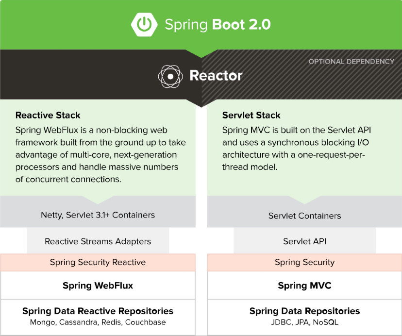

# WebFlux

## 反应式编程

随着异步I/O和Netty等框架的流行，反应式编程逐渐走入大众的视野。

**反应式宣言**概括了反应式应用程序的特点：

* 即时响应性：只要有可能，系统就会及时地做出响应。
* 弹性：系统在出现失败时依然保持即时响应性。弹性通过复制、遏制、隔离以及委派来实现。失败被包含在每个组件内部，和其他组件相互隔离，从而确保系统的各个部分能够在不危机整个系统的情况下失败和恢复。每个组件的恢复都被委派给另一个外部的组件，并在必要时通过复制来实现高可用，所以组件的客户端没有处理组件失败的负担。
* 适应性：系统在变化的工作负载之下依然保持着即时响应性。系统通过增加或减少分配给服务于输入（负载的）资源，来响应输入（负载的）速率的变化。在设计上没有争用点和中心化瓶颈，从而可以分片或者复制组件，并在它们之间分发输入（的负载）能力。通过提供相关的实时性能测量信息，反应式系统都支持预测式以及反应式伸缩算法。在日常的硬件以及软件平台上实现了成本高效的适应性。
* 消息驱动：反应式系统依赖异步的消息传递来确立组件之间的边界，以确保松散耦合、隔离以及位置透明性。使用显式的消息传递，通过在系统中形成并监视消息流队列，并在必要的时候应用回压，从而实现了负载管理、适应性以及流控制。使用位置透明性的消息传递作为通信的手段，使得跨集群或者在单个主机中使用相同的构造和语义管理失败成为了可能。非阻塞的通信使得接收者可以只在活动的时候消耗资源，从而带来更少的系统开销。

反应式系统的核心其实是即时响应性，实现即时响应性的手段是消息驱动的方式，弹性和适应性是保证即时响应的支撑。

## Spring WebFlux



* 框架分成两个相对独立的技术栈：Reactive和Servlet
* Servlet技术栈（Spring MVC）依然构建在Servlet API 以及Servlet 容器之上
* Reactive技术栈（Spring WebFlux）构建在反应式流以及Netty、Servlet3.1+ 容器之上
* Spring Security 为两种不同的技术栈提供了安全性的支持
* Spring Data 分别为两种不同的技术栈实现了Repository
* 在数据访问方面，反应式Repository已经涵盖了Mongo、Cassandra、Redis以及Couchbase。在关系型数据库方面，由于JDBC规范本身是阻塞式的，所以进展不明显。

Spring WebFlux 构建在Reactor框架之上，提供了基于注解和函数式两种方式来配置和运行。

## Reactor

Reactor框架是一个反应式流规范的实现，用于在JVM上构建非阻塞的应用。3.0版本开始，Reactor组织成了多个项目：


反应式流规范对核心操作进行了定义，仅包含四个接口：


其中，`Publisher`接口定义了消息的发布功能，它只包含 一个方法，是一个函数式接口：

``` java
public interface Publisher<T> {
    // 订阅
    public void subscribe(Subscriber<? super T> s);
}
```

`Subscriber`接口定义了消息的订阅者，包含当订阅者接收到消息或遇到错误情况时的生命周期回调：

``` java
public interface Subscriber<T> {
    // 订阅时的回调方法
    public void onSubscribe(Subscription s);

    // 当接收到一条数据时的回调方法
    public void onNext(T t);

    // 当出现错误时的回调方法，失败的终止状态
    public void onError(Throwable t);

    // 成功的终止状态
    public void onComplete();
}
```

当`Subscriber`订阅成功后会得到一个`Subscription`对象，该对象能够控制订阅者与发布者之间的消息的请求和传输：

``` java
public interface Subscription<T> {
    // 订阅者请求一定数量的数据条目
    public void request(Long n);

    // 请求发布者取消发送数据并清理资源
    public void cancel();
}
```

通过`request`方法，能够控制订阅者消费数据的速度，实现回压。订阅者可以通过`request`方法来声明其一次所能处理的消息数量，而生产者据此产生相应数量的消息，当下一次`request`方法调用时，再继续生成新的消息。

`Processor`接口扩展了`Subscriber`和`Publisher`接口，代表一个处理阶段。

## 使用Maven初始化Reactor环境

``` xml
    <dependencies>
        <dependency>
            <groupId>io.projectreactor</groupId>
            <artifactId>reactor-core</artifactId>
            <version>${reactor-core.version}</version>
        </dependency>
        <dependency>
            <groupId>org.assertj</groupId>
            <artifactId>assertj-core</artifactId>
            <version>${assertj.version}</version>
            <scope>test</scope>
        </dependency>
        <dependency>
            <groupId>org.assertj</groupId>
            <artifactId>assertj-core</artifactId>
            <version>3.1.0</version>
        </dependency>
        <dependency>
            <groupId>ch.qos.logback</groupId>
            <artifactId>logback-classic</artifactId>
            <version>1.1.3</version>
        </dependency>
    </dependencies>
    <properties>
        <reactor-core.version>3.0.5.RELEASE</reactor-core.version>
        <assertj.version>3.6.1</assertj.version>
    </properties>
```

* 声明对`reactor-core` 3.0.5 版本的依赖
* 添加assertj和logback来在代码中执行判断和打印日志

## 使用Flux和Mono构建流式数据

Reactor提供了`Flux`和`Mono`两个类来构造流数据，它们都位于`reactor.core.publisher`包中，并实现了`org.reactivestreams.Publisher`接口，核心功能类似，均用于生成异步的数据序列，区别在于：

* `Flux`表示$0-N$ 个元素的异步序列
* `Mono`表示$0-1$个元素

`Flux`和`Mono`中的元素类型可以分为三类：

* 正常的元素值
* 完成信号
* 错误信号

依据反应式流的规范，下游的订阅者可以通过`onNext`、`onComplet`或`onError`方法来对其进行处理。

`Flux`的核心功能：


`Mono`的核心功能：


### 生成静态数据

``` java
Flux<String> seq1 = Flux.just("foo", "bar", "foobar");

List<String> iterable = Arrays.asList("foo", "bar", "foobar");
Flux<String> seq2 = Flux.fromIterable(iterable);

Mono<String> data = Mono.just("foo");
Flux<Integer> numbersFromFiveToSeven = Flux.range(5, 3);
```

`Flux`和`Mono`都通过`just`方法生成了静态的数据序列；`Flux.fromIterable`能够将数组中的元素放到一个数据序列中；`Flux.range`方法则会生成一定范围的数据序列，在上面的例子中，第一个参数表示从`5`开始，第二个参数表示要生成`3`个元素，上面的代码所生成的数据序列也就是`5,6,7`。

### 生成灵活的数据

Reactor 提供了`generate`和`create`方法用来生成数据序列。它们都会暴露一个方法来触发事件，这里将其称为`sink`。

简单形式的`generate`方法签名如下所示：

```java
public static <T> Flux<T> generate(Consumer<SynchronousSink<T>> generator)
```

它接收一个 `generator()` 函数生成所需的数据序列，比如：

``` java
 Flux.generate(sink -> {
            sink.next("Hello");
            sink.complete();
        })
```

借助如下的方法，能够基于一定的初始状态生成数据序列：

``` java
public static <T, S> Flux<T> generate(Callable<S> stateSupplier, BiFunction<S, SynchronousSink<T>, S> generator)
```

简单用法如下所示：

``` java
Flux<String> flux = Flux.generate(
    () -> 0,
    (state, sink) -> {
      sink.next("3 x " + state + " = " + 3*state);
      if (state == 10) sink.complete();
      return state + 1;
    });
```

将初始值设置为0，根据这个值生成数据序列，并且限定了数据序列结束的条件，在`return`语句中我们将`state`的值加1，这样下次调用时就会变成一个新的值了。

`create`方法能够以同步或异步的方式生成数据，它在内部使用的是`FluxSink`，它能够在一次调用中生成多条数据：

``` java
Flux<Integer> flux = Flux.create(sink -> {
    for (int i = 0; i < 5; i++) {
        sink.next(i);
    }
    sink.complete();
});
```

生成了包含`0,1,2,3,4`的数据序列。

### 订阅流式数据序列

在处理数据序列时，可以使用`subscribe`方法添加自定义的订阅逻辑，`subscribe`能够接收一个 lambda 表述式，在表达式中编写自定义的业务逻辑。

``` java
List<Integer> elements = new ArrayList<>();
Flux.just(1, 2, 3, 4)
      .log()
      .subscribe(elements::add);
assertThat(elements).containsExactly(1,2,3,4);
```

使用`Flux.just`生成一个静态数据序列，然后将得到的数据通过`subscribe`方法添加到了一个数组中，然后判断数组中的元素是否符合预期。

在上面的示例代码中，只会处理正常的数据序列，忽略掉了可能会出现的错误信号和完成信号。如果想添加自定义的逻辑来处理这种状况的话，可以使用`subscribe`的其他重载形式，比如：

``` java
public final Disposable subscribe(Consumer<? super T> consumer,
            Consumer<? super Throwable> errorConsumer, Runnable completeConsumer)
```

### 对流式数据进行操作

在得到流式数据之后，可以进行一些预处理，这个过程叫做操作符（Operator），比如在前面的样例中，通过`Flux.just`构建完数据之后，调用了`log()`方法，该方法会将数据序列中的每一个条目打印出来，上面样例的控制台输出如下所示：

``` java
19:57:44.611 [main] DEBUG reactor.util.Loggers$LoggerFactory - Using Slf4j logging framework
19:57:44.655 [main] INFO  reactor.Flux.Array.1 - | onSubscribe([Synchronous Fuseable] FluxArray.ArraySubscription)
19:57:44.660 [main] INFO  reactor.Flux.Array.1 - | request(unbounded)
19:57:44.660 [main] INFO  reactor.Flux.Array.1 - | onNext(1)
19:57:44.661 [main] INFO  reactor.Flux.Array.1 - | onNext(2)
19:57:44.661 [main] INFO  reactor.Flux.Array.1 - | onNext(3)
19:57:44.661 [main] INFO  reactor.Flux.Array.1 - | onNext(4)
19:57:44.661 [main] INFO  reactor.Flux.Array.1 - | onComplete()
```

除了`log`方法以外，还有许多其他的方法可供调用，比如通过`map`操作遍历序列中的每个元素：

``` java
Flux.just(1, 2, 3, 4)
    .log()
    .map(i -> i * 2)
    .subscribe(elements::add);
assertThat(elements).containsExactly(2,4,6,8);
```

### 并发操作

在默认情况下，`Flux`和`Mono`相关的操作都会在主线程中执行，默认并不是多线程，这与 RxJava 非常类似，Reactor 也提供了一个名为`Schedulers`的类，允许指定多线程相关的逻辑，借助`Schedulers`，数据处理可以在当前进程、调度器甚至已有的`ExecutorService`中执行：

``` java
List<Integer> elements = new ArrayList<>();
Executor executor = Executors.newSingleThreadExecutor();
Flux.just(1, 2, 3, 4)
   .log()
   .map(i -> i * 2)
   .subscribeOn(Schedulers.fromExecutor(executor))
   .subscribe(elements::add);

assertThat(elements).containsExactly(2,4,6,8);
```

上述代码的输出如下所示：

``` java
20:20:34.140 [main] DEBUG reactor.util.Loggers$LoggerFactory - Using Slf4j logging framework
20:20:34.202 [pool-1-thread-1] INFO  reactor.Flux.Array.1 - | onSubscribe([Synchronous Fuseable] FluxArray.ArraySubscription)
20:20:34.206 [pool-1-thread-1] INFO  reactor.Flux.Array.1 - | request(unbounded)
20:20:34.206 [pool-1-thread-1] INFO  reactor.Flux.Array.1 - | onNext(1)
20:20:34.206 [pool-1-thread-1] INFO  reactor.Flux.Array.1 - | onNext(2)
20:20:34.206 [pool-1-thread-1] INFO  reactor.Flux.Array.1 - | onNext(3)
20:20:34.206 [pool-1-thread-1] INFO  reactor.Flux.Array.1 - | onNext(4)
20:20:34.206 [pool-1-thread-1] INFO  reactor.Flux.Array.1 - | onComplete()
```

对比之前的输出，可以看到，对于数据序列的处理目前是在池中一个线程中运行的。

## 编程模型

Spring WebFlux 提供了两种编程模型，分别是基于注解的控制器和函数式端点，按照[其文档的描述](https://docs.spring.io/spring/docs/5.0.2.RELEASE/spring-framework-reference/web-reactive.html#webflux-programming-models)，两者的适用场景如下所示：

- 基于注解的控制器：与 Spring MVC 一致，基于`spring-web`模块中相同的注解。
- 函数式端点：基于 lambda 表达式，轻量级函数式的模型。可以将其想象为一个小的库或者一个工具集，应用可以使用它来路由或处理请求。它与注解控制器的区别在于应用要从头到尾搭建请求处理的环境，而注解的方式只需声明意图就可以了，背后的事情由框架来负责处理。

对于小型、完全从头构建的服务，可以考虑函数式的方式，而如果是改造已有的服务，推荐采用注解的方式。

## WebFlux 的核心类简介

为了支持不同类型的服务器，WebFlux 抽象出了`HttpHandler`接口，它是一个简单的协议，代表了能够处理请求和响应的方法。在此基础之上，`WebHandler`提供了更高层级的抽象，并且能够实现异常处理`WebExceptionHandler`和过滤器`WebFilter`等功能。

在注解控制器和函数式端点编程模型中，都是基于`HttpHandler`和`WebHandler`接口实现的，但是两种实现方式略有差异。

在注解控制器编程模型中，WebFlux 与 Spring MVC 非常类似，有一个类似于 Spring MVC 前端控制器`DispatcherServlet`的类，名为`DispatcherHandler`，它会总体负责请求的处理，而实际的请求映射、请求调用以及结果的处理则是分别由`HandlerMapping`、`HandlerAdapter`和`HandlerResultHandler`来实现的。

- HandlerMapping：根据客户端的请求查询能够处理该请求的方法；
- HandlerAdapter：真正负责请求的处理，目前有两个最重要的实现类，分别对应注解控制器和函数式模型；
- HandlerResultHandler：针对响应结果进行处理，支持在请求体返回各种类型的内容以及视图的处理。

在函数式编程模型中，有两个重要的函数式接口，分别是`RouterFunction`和`HandlerFunction`，其中`RouterFunction`实现了路由功能，将请求转发给对应的 handler，`HandlerFunction`则代表了处理传入请求并生成响应的函数。

## 示例程序

实体类如下所示：

``` java
public class Student {

    private String name;


    private int age;


    private String gender;
       // 省略getter和setter方法
    }
```

操作实体的 Repository 接口如下：

``` java
public interface StudentRepository {

    /**
     * 根据id获取学生
     * @param id
     * @return
     */
    Mono<Student> getStudent(int id);

    /**
     * 得到所有的学生
     * @return
     */
    Flux<Student> getAllStudents();

    /**
     * 保存
     * @param student
     * @return
     */
    Mono<Void> saveStudent(Mono<Student> student);

}
```

在本例中，模拟了一个`StudentRepository`的实现，基于存在于内存中的数据进行各种存储相关的操作。

模拟的`StudentRepository`实现如下所示：

``` java
public class StudentRepositoryImpl implements StudentRepository{

    private final Map<Integer, Student> students = new HashMap<>();

    public StudentRepositoryImpl() {
        this.students.put(1, new Student("Li Lei", 15,"Male"));
        this.students.put(2, new Student("Han Meimei", 14,"Female"));
    }

    @Override
    public Mono<Student> getStudent(int id) {
        return Mono.justOrEmpty(this.students.get(id));
    }

    @Override
    public Flux<Student> getAllStudents() {
        return Flux.fromIterable(this.students.values());
    }

    @Override
    public Mono<Void> saveStudent(Mono<Student> personMono) {
        return personMono.doOnNext(person -> {
            int id = students.size() + 1;
            students.put(id, person);
        }).thenEmpty(Mono.empty());
    }
}
```

在上面的代码中，初始化了一个静态的`Map`存放实体，并基于此实现了实体的检索和新增功能。
需要注意的是，这些方法返回的都是`Mono`或`Flux`类型的值，为了便于在控制器中以反应式的模式消费这些数据。

## 基于注解控制器的编程模型

基于注解控制器的编程模型与 Spring MVC 非常类似，需要使用注解为`@Controller`和`@RestController`组件定义请求映射、请求输入以及异常处理等等。采用这种方式，方法签名非常灵活并且不需要扩展任何特定的接口或基类。如下是使用注解的控制器类：

``` java
@RestController
public class ReactiveStudentController {

    @Autowired
    private StudentRepository repository;

    @GetMapping("/student/{id}")
    public Mono<Student> getStudentById(@PathVariable("id") int id) {
        return repository.getStudent(id);
    }

    @GetMapping(value = "/student")
    public Flux<Student> getAllStudent() {

        return repository.getAllStudents();
    }

    @PostMapping(value = "/student")
    public Mono<Void> createStudent(@RequestBody  Student student) {
        Mono<Student> studentMono = Mono.just(student);
        return repository.saveStudent(studentMono);
    }
}
```

在这个类中，编码方式与常规的 Spring MVC 非常类似，只不过这里返回的是`Mono`、`Flux`这些在 Reactor 中所定义的类型。其实，它的返回类型并非必须如此，它可以[返回 Reactor、RxJava 以及其他类型](https://docs.spring.io/spring/docs/5.0.2.RELEASE/spring-framework-reference/web-reactive.html#webflux-ann-return-types)，针对不同的返回值，对应的`HandlerResultHandler`实现类会对其进行相应的处理。

只需运行 Spring Initializr 自动生成的引导类即可启动：

``` java
@SpringBootApplication
public class SpringReactiveAnnotationApplication {

    public static void main(String[] args) {
        SpringApplication.run(SpringReactiveAnnotationApplication.class, args);
    }
}
```

## 函数式端点的编程模型

在基于函数式端点的编程模型中，有两个核心的接口，分别是`RouterFunction`和`HandlerFunction`，其中`RouterFunction`实现了路由功能，将请求转发给对应的 handler，`HandlerFunction`则代表了处理传入请求并生成响应的函数。在这种编程模型中，核心任务就是定义这两个函数式接口的实现并启动所需的服务器。

首先定义`HandlerFunction`。`HandlerFunction`是函数式接口，只有一个具有如下签名的方法需要实现：

``` java
Mono<T extends ServerResponse> handle(ServerRequest request)
```

该接口接收一个`ServerRequest`类型输入，并生成`Mono<T extends ServerResponse>`类型的输出。

将处理请求的函数统一定义到如下的`StudentHandler`中，它负责处理前端发送过来的各种请求：

``` java
public class StudentHandler {

    private final StudentRepository repository;

    public StudentHandler(StudentRepository repository) {
        this.repository = repository;
    }

    public Mono<ServerResponse> getStudentById(ServerRequest request) {
        int personId = Integer.valueOf(request.pathVariable("id"));
        Mono<ServerResponse> notFound = ServerResponse.notFound().build();
        Mono<Student> studentMono = this.repository.getStudent(personId);
        return studentMono
                .flatMap(person -> ServerResponse.ok().contentType(APPLICATION_JSON)
                        .body(fromObject(person)))
                .switchIfEmpty(notFound);
    }


    public Mono<ServerResponse> createStudent(ServerRequest request) {
        Mono<Student> student = request.bodyToMono(Student.class);
        return ServerResponse.ok().build(this.repository.saveStudent(student));
    }

    public Mono<ServerResponse> getAllStudent(ServerRequest request) {
        Flux<Student> student = this.repository.getAllStudents();
        return ServerResponse.ok().contentType(APPLICATION_JSON).body(student, Student.class);
    }
}
```

通过函数`RouterFunction`来定义路由信息，确定调用这些函数的条件，`RouterFunction`的签名如下所示：

``` java
public interface RouterFunction<T extends ServerResponse> {

    Mono<HandlerFunction<T>> route(ServerRequest request);

}
```

针对传递过来的请求，`RouterFunction`需要返回对应的`HandlerFunction`。当找到对应的`HandlerFunction`后，WebFlux 会自动调用对应的函数并生成`Mono<ServerResponse>`。

定义`RouterFunction`如下所示：

``` java
 public RouterFunction<ServerResponse> routingFunction() {
        StudentRepository repository = new StudentRepositoryImpl();
        StudentHandler handler = new StudentHandler(repository);

        return RouterFunctions.nest(path("/student"),
                nest(accept(APPLICATION_JSON),
                        route(GET("/{id}"), handler::getStudentById)
                                .andRoute(method(HttpMethod.GET), handler::getAllStudent)
                ).andRoute(POST("/").and(contentType(APPLICATION_JSON)), handler::createStudent));
    }
```

借助`RouterFunctions`类的静态方法`route`，定义了该应用的路由。在上面的代码中，声明了针对`/student`的GET请求，将由`StudentHandler`的`getAllStudent`方法来响应，针对`/student`的 POST 请求，将由`StudentHandler`的`createStudent`方法来响应，针对`/student/{id}`的 GET 请求，将由`StudentHandler`的`getStudentById`方法来响应。

定义好了路由和 handler 信息，需要服务器将它们组合起来，这样才能真正接收用户的请求。WebFlux 支持多种服务器，在这里使用 Netty：

``` java
public void startReactorServer() throws InterruptedException {
        RouterFunction<ServerResponse> route = routingFunction();
        HttpHandler httpHandler = toHttpHandler(route);

        ReactorHttpHandlerAdapter adapter = new ReactorHttpHandlerAdapter(httpHandler);
        HttpServer server = HttpServer.create(HOST, PORT);
        server.newHandler(adapter).block();
    }
```

使用Tomcat：

``` java
 public void startTomcatServer() throws LifecycleException {
        RouterFunction<?> route = routingFunction();
        HttpHandler httpHandler = toHttpHandler(route);

        Tomcat tomcatServer = new Tomcat();
        tomcatServer.setHostname(HOST);
        tomcatServer.setPort(PORT);
        Context rootContext = tomcatServer.addContext("", System.getProperty("java.io.tmpdir"));
        ServletHttpHandlerAdapter servlet = new ServletHttpHandlerAdapter(httpHandler);
        Tomcat.addServlet(rootContext, "httpHandlerServlet", servlet);
        rootContext.addServletMapping("/", "httpHandlerServlet");
        tomcatServer.start();
    }
```

不管是采用 Netty 还是 Tomcat，都需要根据`RouterFunction`生成`HttpHandler`类，因为这个类将会负责 WebFlux 中复杂的请求处理流程。

## 新的客户端辅助类 WebClient

如果要测试前文中的样例的话，可以直接使用浏览器发送 GET 请求，使用 HTTP 工具库或浏览器插件发送 POST 请求。不过，为了支持反应式编程模型，WebFlux 中提供了 WebClient 客户端调用类，在这里使用 WebClient 发起服务调用，依次调用前文中声明的三个服务：

``` java
 public static void main(String[] args){
        WebClient client = WebClient.create("http://127.0.0.1:8089");

        String id = "1";
        Student result = client.get()
                .uri("/student/{id}", id).accept(MediaType.APPLICATION_JSON)
                .retrieve()
                .bodyToMono(Student.class)
                .block();
        System.out.println(result.getName());

        Mono<Student> studentMonoToSave = Mono.just(new Student("Jim",14,"Male"));

        client.post()
                .uri("/student")
                .contentType(MediaType.APPLICATION_JSON)
                .body(studentMonoToSave, Student.class)
                .retrieve()
                .bodyToMono(Void.class)
                .block();


        Flux<Student> results = client.get()
                .uri("/student").accept(MediaType.APPLICATION_JSON)
                .retrieve()
                .bodyToFlux(Student.class);

        results
                .map(student -> student.getName())
                .log()
                .buffer()
                .doOnNext(System.out::println)
                .blockFirst();
    }
```

在上面的代码中，首先基于服务器的 URL 地址构建了`WebClient`类，然后通过它的`get`或`post`方法指定 HTTP 请求的类型，随后借助`retrieve`发送请求。根据 HTTP 响应的内容不同，可以将请求体转换为`Mono`或`Flux`，便于后续基于 Reactor 接口进行相关的反应式操作。

除了`WebClient`类之外，WebFlux 还提供了`WebTestClient`类，用于对 WebFlux 反应式服务端点进行测试。

## 高级配置的实现

我们可以配置自定义的过滤器、配置静态资源的处理逻辑、视图解析、CORS、反应式安全等功能。

为了实现自定义的高级配置，在注解式控制器模型中，可以通过让配置类扩展`WebFluxConfigurer`的方式来实现；而在函数式编程模型中，则可以在定义`RouterFunction`的时候，声明路由相关的功能，还可以在初始化`HttpHandler`的时候，通过实例化自己的`HandlerStrategies`传入自定义请求处理相关的逻辑：

``` java
HttpHandler toHttpHandler(RouterFunction<?> routerFunction, HandlerStrategies strategies)
```

两个常用的配置项:

### 配置过滤器

`WebHandler`支持配置`WebFilter`实现类似 Servlet API 中过滤器的功能。`WebFilter`的方法签名如下所示：

``` java
public interface WebFilter {

Mono<Void> filter(ServerWebExchange exchange, WebFilterChain chain);

}
```

可以在代码中声明自己的`WebFilter`并注册为 Spring 中的 bean，WebFlux 在运行时会自动查找到自定义的过滤器。

要在注解编程模型中使用过滤器的话，需要在`RouterFunction`上调用`filter`方法，该方法的签名如下：

``` java
<S extends ServerResponse> RouterFunction<S> filter(HandlerFilterFunction<T, S> filterFunction)
```

它接收一个函数式接口`HandlerFilterFunction`作为输入，该接口必须要实现一个签名如下的方法：

``` java
Mono<R> filter(ServerRequest request, HandlerFunction<T> next);
```

因此，我们可以使用 lambda 表达式声明简单的过滤器，比如一个简单的过滤器可以声明如下：

``` java
router.filter((request, next) -> {

    System.out.println("handling: " + request.path());

    return next.handle(request);

});
```

### 配置静态资源的处理

在 Web 程序中，经常会使用到静态的资源。在使用控制器编程模型时，可以扩展`WebFluxConfigurer`类的`addResourceHandlers`方法声明静态资源的处理逻辑：

``` java
@Configuration
@EnableWebFlux
public class WebConfig implements WebFluxConfigurer {

    @Override
    public void addResourceHandlers(ResourceHandlerRegistry registry) {
        registry.addResourceHandler("/resources/**")
            .addResourceLocations("/public", "classpath:/static/")
            .setCachePeriod(31556926);
    }

}
```

而在函数式编程模型中，可以借助`RouterFunctions`的`resources`方法声明查找模式和资源路径，`resources`有两个重载形式，分别为：

``` java
RouterFunction<ServerResponse> resources(String pattern, Resource location);

RouterFunction<ServerResponse> resources(Function<ServerRequest, Mono<Resource>> lookupFunction)
```

可以使用如下方式声明对静态资源的访问逻辑：

``` java
RouterFunction router = resources(
  "/files/**", new ClassPathResource("files/"));
```

这样针对`/files`的请求将会以静态资源的方式进行响应。

在上面的样例中，使用的是基于内存的 Repository 检索数据。

## WebFlux 源码剖析

### 核心接口导读

WebFlux 抽象了名为`HttpHandler`的接口，该接口是对 HTTP 请求处理的最底层抽象，通过这个抽象能够将不同的运行时服务器统一起来，所以不管是注解控制器方式的编程还是函数式的编程，在初始化环境时，都需要初始化这么一个类的实例，`HttpHandler`的定义如下所示：

``` java
public interface HttpHandler {
    Mono<Void> handle(ServerHttpRequest request, ServerHttpResponse response);
}
```

这是一个非常简单的接口，所抽象的功能就是处理给定的请求并写回响应。各种服务器在初始化的时候，都需要基于`HttpHandler`建立各自的适配器（Adapter）完成容器的初始化。

`WebHandler`则在此之上提供了链式处理的功能，借助它可以将异常处理器（`WebExceptionHandler`）、过滤器（`WebFilter`）以及目标 handler（`WebHandler`）组合起来。`WebHandler`的定义如下所示：

``` java
public interface WebHandler {

    Mono<Void> handle(ServerWebExchange exchange);

}
```

在这里有一个`WebHandlerDecorator`能够通过装饰者模式将各种`WebHandler`功能组合在一起，实现异常处理、过滤器等功能，所形成的层级结构如下所示：


其中，`HttpWebHandlerAdapter`同时实现了`HttpHandler`和`WebHandler`，是 WebFlux 中非常重要的一个类，它会进行适配，将对`HttpHandler`接口的调用转换为对`WebHandler`接口的调用。

### 环境启动过程分析

WebFlux 支持两种编程模型，分别是注解控制器和函数式编程方式。在这两种运行方式中，有一些内容是共通的，比如在初始化的时候，需要基于`HttpHandler`启动服务器、定义请求映射、运行结果的处理等等。

#### 注解方式启动

Spring Boot 应用在启动时，需要调用`SpringApplication`的`run`方法，该方法在启动的时候会判断 Web 应用的类型：

``` java
private WebApplicationType deduceWebApplicationType() {
        if (ClassUtils.isPresent(REACTIVE_WEB_ENVIRONMENT_CLASS, null)
                && !ClassUtils.isPresent(MVC_WEB_ENVIRONMENT_CLASS, null)) {
            return WebApplicationType.REACTIVE;
        }
        for (String className : WEB_ENVIRONMENT_CLASSES) {
            if (!ClassUtils.isPresent(className, null)) {
                return WebApplicationType.NONE;
            }
        }
        return WebApplicationType.SERVLET;
    }
```

在这里，应用中因为存在`DispatcherHandler`并且不存在`DispatcherServlet`类，所以会被判定为 Reactive 类型的应用。根据应用类型的不同，会选择使用不同的 Spring `ApplicationContext`来初始化应用：

``` java
protected ConfigurableApplicationContext createApplicationContext() {
        Class<?> contextClass = this.applicationContextClass;
        if (contextClass == null) {
            try {
                switch (this.webApplicationType) {
                case SERVLET:
                    contextClass = Class.forName(DEFAULT_WEB_CONTEXT_CLASS);
                    break;
                case REACTIVE:
                    contextClass = Class.forName(DEFAULT_REACTIVE_WEB_CONTEXT_CLASS);
                    break;
                default:
                    contextClass = Class.forName(DEFAULT_CONTEXT_CLASS);
                }
            }
            catch (ClassNotFoundException ex) {
                throw new IllegalStateException(
                        "Unable create a default ApplicationContext, "
                                + "please specify an ApplicationContextClass",
                        ex);
            }
        }
        return (ConfigurableApplicationContext) BeanUtils.instantiateClass(contextClass);
    }
```

在 Reactive 应用类型下，将会使用`AnnotationConfigReactiveWebServerApplicationContext`初始化应用上下文。

Spring Boot 的自动配置功能依赖于 spring-boot-autoconfigure.jar 包中的`META-INF/spring.factories`所定义的`org.springframework.boot.autoconfigure.EnableAutoConfiguration`属性，与反应式编程相关的自动配置类包括`ReactiveWebServerAutoConfiguration`、`WebFluxAutoConfiguration`、`HttpHandlerAutoConfiguration`等。

首先看一下`ReactiveWebServerAutoConfiguration`，在这个配置类中导入了各个服务器对应的配置类，自动配置功能会根据类路径下存在哪个服务器所对应的主类，自动选择所需的 Web 服务器，比如这里使用的是 Netty：

``` java
@ConditionalOnMissingBean(ReactiveWebServerFactory.class)
    @ConditionalOnClass({ HttpServer.class })
    static class ReactorNettyAutoConfiguration {

        @Bean
        public NettyReactiveWebServerFactory NettyReactiveWebServerFactory() {
            return new NettyReactiveWebServerFactory();
        }

    }
```

在这里会自动注册 Netty 所对应的 Web 服务器。

然后再看一下`WebFluxAutoConfiguration`这个配置类，这个类又间接导入了`WebFluxConfigurationSupport`，从而初始化了一系列 WebFlux 运行所需的组件：

- `DispatcherHandler`：类似于 Spring MVC 中的`DispatcherServlet`，作为前端控制器负责整个框架的运行；
- `RequestMappingHandlerMapping`和`RouterFunctionMapping`：分别负责处理`@RequestMapping`和函数式编程所对应的请求映射；
- `RequestMappingHandlerAdapter`和`HandlerFunctionAdapter`：负责请求的处理；
- `HandlerMethodArgumentResolver`：负责控制器参数的解析；
- `ConfigurableWebBindingInitializer`和`DefaultFormattingConversionService`：负责数据参数的绑定和类型转换；
- `HandlerResultHandler`：负责处理 handler 返回的结果。

上面的这些类，其实和 Spring MVC 中对应的类名称完全相同，WebFlux 采用了类似的机制来处理请求。

最后，看一下`HttpHandlerAutoConfiguration`配置类，这个类非常简单：

``` java
public class HttpHandlerAutoConfiguration {

    @Configuration
    public static class AnnotationConfig {

        private ApplicationContext applicationContext;

        public AnnotationConfig(ApplicationContext applicationContext) {
            this.applicationContext = applicationContext;
        }

        @Bean
        public HttpHandler httpHandler() {
            return WebHttpHandlerBuilder.applicationContext(this.applicationContext)
                    .build();
        }

    }

}
```

在这里基于环境的应用上下文构建了`HttpHandler`，看一下`build`方法：

``` java
public HttpHandler build() {

        WebHandler decorated;

        decorated = new FilteringWebHandler(this.webHandler, this.filters);
        decorated = new ExceptionHandlingWebHandler(decorated,  this.exceptionHandlers);

        HttpWebHandlerAdapter adapted = new HttpWebHandlerAdapter(decorated);
        if (this.sessionManager != null) {
            adapted.setSessionManager(this.sessionManager);
        }
        if (this.codecConfigurer != null) {
            adapted.setCodecConfigurer(this.codecConfigurer);
        }
        if (this.localeContextResolver != null) {
            adapted.setLocaleContextResolver(this.localeContextResolver);
        }

        return adapted;
    }
```

在这里，使用前文所述的装饰者模式，生成了具备过滤器、异常处理等功能的`HttpWebHandlerAdapter`，而`this.webHandler`才是进行整个 HTTP 请求的核心，它是在`WebFluxAutoConfiguration`中定义的`DispatcherHandler`，在这里是通过前面的`WebHttpHandlerBuilder.applicationContext(this.applicationContext)`将其取到的：

``` java
public static WebHttpHandlerBuilder applicationContext(ApplicationContext context) {
        WebHttpHandlerBuilder builder = new WebHttpHandlerBuilder(
                context.getBean(WEB_HANDLER_BEAN_NAME, WebHandler.class));
        //初始化会话管理、请求读取和写入的基础类、本地化功能等
        ……
}
```

反应式应用所对应的 Spring bean 叫做`AnnotationConfigReactiveWebServerApplicationContext`，在其超类的`onRefresh`方法中，声明了应用上下文在刷新的时候，需要启动 Web 服务器：

``` java
    protected void onRefresh() {
        super.onRefresh();
        try {
            createWebServer();
        }
        catch (Throwable ex) {
            ……
        }
    }
```

继续查看`createWebServer`方法：

``` java
private void createWebServer() {
        WebServer localServer = this.webServer;
        if (localServer == null) {
            this.webServer = getWebServerFactory().getWebServer(getHttpHandler());
        }
        initPropertySources();
    }
```

在这里，最终将会调用`NettyReactiveWebServerFactory`的`getWebServer`方法：

``` java
    public WebServer getWebServer(HttpHandler httpHandler) {
        HttpServer server = createHttpServer();
        ReactorHttpHandlerAdapter handlerAdapter = new ReactorHttpHandlerAdapter(
                httpHandler);
        return new NettyWebServer(server, handlerAdapter);
    }
```

而在服务器启动时，将会调用`reactor.ipc.netty.tcp.TcpServer`的`newHandler`方法，启动 Netty 并且将上文中的`ReactorHttpHandlerAdapter`（对`HttpHandler`进行了一下适配，使其能够适应 Netty 环境，其他环境会有不同的适配器）传递进来，生成 Netty 的`ChannelHandler`：

``` java
public final Mono<? extends NettyContext> newHandler(BiFunction<? super NettyInbound, ? super NettyOutbound, ? extends Publisher<Void>> handler) {
        Objects.requireNonNull(handler, "handler");
        return Mono.create(sink -> {
            ServerBootstrap b = options.get();
            SocketAddress local = options.getAddress();
            b.localAddress(local);
            ContextHandler<Channel> contextHandler = doHandler(handler, sink);
            b.childHandler(contextHandler);
            if(log.isDebugEnabled()){
                b.handler(loggingHandler());
            }
            contextHandler.setFuture(b.bind());
        });
    }
```

**反应式环境初始化的总结：**

- `SpringApplication`会根据类路径中包含的类，自动判别这是反应式 Web 应用，并使用`AnnotationConfigReactiveWebServerApplicationContext`作为应用的上下文；
- 借助 Spring Boot 提供的自动配置类，确定应用运行所需的服务器类型，初始化请求处理相关的各个组件，并准备好启动服务器所需的`HttpHandler`；
- `AnnotationConfigReactiveWebServerApplicationContext`在`refresh`时会自动创建并启动服务器，将包含`HttpHandler`的`ReactorHttpHandlerAdapter`传递进去，初始化 Netty 的运行时环境。

#### 函数式编程模型的初始化

在 Spring Boot 中，同样能够使用函数式编程模型，只需将`RouterFunction`和相关的`Hanlder`实现声明为 Spring bean 即可，具体可以参见 [Spring Boot 的文档](https://docs.spring.io/spring-boot/docs/2.0.0.M7/reference/htmlsingle/#boot-features-webflux)。

在这里看一下在前面的文章中所介绍的，开发人员手动启动 ReactorServer 的流程。在样例中，会首先声明`RouterFunction`和对应的 handler 实例，然后调用如下的过程初始化服务器：

``` java
public void startReactorServer() throws InterruptedException {
        RouterFunction<ServerResponse> route = routingFunction();
        HttpHandler httpHandler = toHttpHandler(route);

        ReactorHttpHandlerAdapter adapter = new ReactorHttpHandlerAdapter(httpHandler);
        HttpServer server = HttpServer.create(HOST, PORT);
        server.newHandler(adapter).block();
    }
```

这里与前文中`NettyReactiveWebServerFactory`的`getWebServer`方法非常类似，只不过服务器初始化所需的`HttpHandler`不是从容器中查询，而是通过`RouterFunctions`的静态方法`toHttpHandler`来生成：

``` java
    public static HttpHandler toHttpHandler(RouterFunction<?> routerFunction) {
        return toHttpHandler(routerFunction, HandlerStrategies.withDefaults());
    }
```

在这里将会调用如下的重载形式：

``` java
    public static HttpHandler toHttpHandler(RouterFunction<?> routerFunction, HandlerStrategies strategies) {
        //初始化WebHandler
        WebHandler webHandler = toWebHandler(routerFunction, strategies);
        //基于已有的WebHandler，生成HttpHandler
        return WebHttpHandlerBuilder.webHandler(webHandler)
                .filters(filters -> filters.addAll(strategies.webFilters()))
                .exceptionHandlers(handlers -> handlers.addAll(strategies.exceptionHandlers()))
                .localeContextResolver(strategies.localeContextResolver())
                .build();
    }
```

`toWebHandler`方法：

``` java
    public static WebHandler toWebHandler(RouterFunction<?> routerFunction, HandlerStrategies strategies) {
        return exchange -> {
            ServerRequest request = new DefaultServerRequest(exchange, strategies.messageReaders());
            addAttributes(exchange, request);
            return routerFunction.route(request)
                    .defaultIfEmpty(notFound())
                    .flatMap(handlerFunction -> wrapException(() -> handlerFunction.handle(request)))
                    .flatMap(response -> wrapException(() -> response.writeTo(exchange,
                            new HandlerStrategiesResponseContext(strategies))));
        };
    }
```

可以看到，最终的`WebHandler`实现是在一个 lambda 表达式中定义的，在这里会调用`routerFunction`的路由确定该有哪个 handler 方法来处理请求、调用 handlerFunction 的`handle`方法完成方法的执行，最后封装异常并将使用`response`来写回响应。**因此，可以说这里的`WebHandler`是整个运行时环境的核心所在。**

`WebHttpHandlerBuilder`会基于这个`WebHandler`生成一个`HttpWebHandlerAdapter`实例，作为`HttpHandler`类型的返回值，在得到`HttpHandler`之后，建立 Web 服务器的过程与前文介绍大同小异。

### 请求流程分析

#### 注解方式的流程分析

在初始化环境的时候，会将`ReactorHttpHandlerAdapter`传递进来，生成 Netty 的`ChannelHandler`，因此请求处理流程也会从这里开始。在`Reactor`的`ChannelOperations`中，会调用`ReactorHttpHandlerAdapter`的`apply`方法，并将包含请求和响应信息的`HttpServerRequest`和`HttpServerRequest`传递进来：

``` java
    public Mono<Void> apply(HttpServerRequest request, HttpServerResponse response) {

        NettyDataBufferFactory bufferFactory = new NettyDataBufferFactory(response.alloc());
        ServerHttpRequest adaptedRequest;
        ServerHttpResponse adaptedResponse;
        try {
            adaptedRequest = new ReactorServerHttpRequest(request, bufferFactory);
            adaptedResponse = new ReactorServerHttpResponse(response, bufferFactory);
        }
        catch (URISyntaxException ex) {

        }

        if (HttpMethod.HEAD.equals(adaptedRequest.getMethod())) {
            adaptedResponse = new HttpHeadResponseDecorator(adaptedResponse);
        }

        return this.httpHandler.handle(adaptedRequest, adaptedResponse)
                .onErrorResume(ex -> {
                    logger.error("Could not complete request", ex);
                    response.status(HttpResponseStatus.INTERNAL_SERVER_ERROR);
                    return Mono.empty();
                })
                .doOnSuccess(aVoid -> logger.debug("Successfully completed request"));
    }
```

适配完请求和响应之后，进而调用`httpHandler.handle`方法，这里的`httpHandler`其实是`HttpWebHandlerAdapter`的实例，`HttpWebHandlerAdapter`本身并不处理请求，而是将其委托给内部的`WebHandler`实现。

具体的`WebHandler`可能会经过`WebHandlerDecorator`的层层包装，从而支持异常处理、过滤器拦截等功能，最终负责处理请求的将是`DispatcherHandler`，会调用其`handle`方法：

``` java
    @Override
    public Mono<Void> handle(ServerWebExchange exchange) {
        if (logger.isDebugEnabled()) {
            ServerHttpRequest request = exchange.getRequest();
            logger.debug("Processing " + request.getMethodValue() + " request for [" + request.getURI() + "]");
        }
        if (this.handlerMappings == null) {
            return Mono.error(HANDLER_NOT_FOUND_EXCEPTION);
        }
        return Flux.fromIterable(this.handlerMappings)
                .concatMap(mapping -> mapping.getHandler(exchange))
                .next()
                .switchIfEmpty(Mono.error(HANDLER_NOT_FOUND_EXCEPTION))
                .flatMap(handler -> invokeHandler(exchange, handler))
                .flatMap(result -> handleResult(exchange, result));
    }
```

可以看到，这里使用 Reactor `Flux` API 依次完成了如下的功能：

- 获取所有的 HandlerMapping；
- 查找适配的 handler，如果没有找到的话，将提示错误；
- 如果找到的话，借助`invokeHandler`方法调用目标 handler 中所定义的方法，在这个过程中类似于 Spring MVC，将会使用反应式版本的`RequestMappingHandlerAdapter`完成真正的方法调用；
- 得到结果后，调用`handleResult`方法，查找合适的`HandlerResultHandler`，完成响应内容的写回。

这里需要注意的是，尽管这些类名看起来和 Spring MVC 请求处理过程中的类名完全相同，但它们都是 Reactive 版本的实现，方法的参数和返回值均不相同，不可将其混淆。在这些中间环节中，框架所使用的都是反应式的编码方式。虽然与 Spring MVC 的整体设计理念非常类似，但是运行模式和编码 API 却是完全不同的。

#### 函数式方式的流程分析

在样例中，基于`RouterFunction`定义了`HttpHandler`，而`HttpHandler`的具体实现同样也是`HttpWebHandlerAdapter`，只不过在初始化`HttpWebHandlerAdapter`时所使用的是 lambda 表达式生成的`WebHandler`。

在请求调用时，依然会首先进入`ReactorHttpHandlerAdapter`，因为它们初始化 Netty 的方式都是完全相同的。前面的流程基本类似，只是在调用`WebHandler`的`handle`方法时，最终会执行到`RouterFunctions`的`toWebHandler`方法所定义的 lambda 表达式中，即上文所看到的：

``` java
public static WebHandler toWebHandler(RouterFunction<?> routerFunction, HandlerStrategies strategies) {


        return exchange -> {
            ServerRequest request = new DefaultServerRequest(exchange, strategies.messageReaders());
            addAttributes(exchange, request);
            return routerFunction.route(request)
                    .defaultIfEmpty(notFound())
                    .flatMap(handlerFunction -> wrapException(() -> handlerFunction.handle(request)))
                    .flatMap(response -> wrapException(() -> response.writeTo(exchange,
                            new HandlerStrategiesResponseContext(strategies))));
        };
    }
```

`routerFunction`会调用`route`方法，根据请求获取对应的`HandlerFunction`，在这里会使用到一个由`RequestPredicate`所定义的断言机制，比如`PathPatternPredicate`会根据请求的路径匹配对应的`HandlerFunction`。

在得到`HandlerFunction`之后，就会调用对应的`handle`方法，因为`HandlerFunction`是一个函数式接口，所以在声明`RouterFunction`的时候，以方法引用的方式进行了定义。

在这个过程中，还会有 HTTP 消息写入和写出的处理细节，这是通过`HttpMessageReader`和`HttpMessageWriter`的多个实现类完成的。
